# Smart Treasury Account "STA" Technical Architecture

| Field | Specification |
|---|---|
| Product | Smart Treasury Account (STA) |
| Network | Stellar / Soroban |
| Asset model | Stellar Asset Contract (SAC) |
| Primary wallets | Freighter and xBull through Stellar Wallets Kit |
| Frontend framework | Scaffold Stellar |
| Architecture level | Full technical design for contracts, dApp, TypeScript SDK, relayer, verification, deployment, and security controls |

## 1. Purpose

This document defines the technical architecture for Smart Treasury Account (STA), a Soroban-native programmable treasury wallet for Stellar.

It describes how STA integrates with Stellar, how the onchain contracts are composed, how wallet and relayer flows work, and which security invariants define a correct deployment across local, testnet, and mainnet environments.

### 1.1 Document Policy and Terminology

This document uses the following policy language:

- **MUST**: required for a secure and correct STA deployment.
- **SHOULD**: strongly recommended; exceptions require explicit engineering approval.
- **MAY**: optional capability that does not affect core security.
- **V1**: the first complete public architecture of STA.
- **Testnet validation flow**: a public Stellar testnet implementation path used to validate the architecture with real Stellar tooling.

Architectural statements are written as target requirements. They do not depend on a specific partial repository state.

## 2. Executive Summary

STA is a policy-controlled treasury account built as a Soroban contract account. Each treasury wallet is a `SmartAccount` contract that can hold Stellar Asset Contract (SAC) balances, validate authorization through `__check_auth`, enforce treasury policy, and route approved execution through narrow adapters.

Protocol summary:

| Area | Design Choice |
|---|---|
| Custody model | Assets are held by a Soroban contract account controlled by onchain policy |
| Authorization model | `__check_auth` validates signers, roles, thresholds, sessions, and execution context |
| Asset support | SAC assets only in V1 |
| Execution model | Approved actions are dispatched through allowlisted adapters |
| Automation model | Stored capabilities and child executions enforce bounded scheduled treasury actions |
| Relayer model | Relayers submit transactions but hold no treasury authority |
| Condition model | Extension-ready signed attestation verification; not required for the core scheduled payment launch flow |
| Recovery model | Pause, freeze, guardian, delayed recovery, and signer replacement controls |
| Observability model | Security-significant events and replay records support audit trails |

STA supports:

- passkey-capable and wallet-first onboarding
- Freighter and xBull wallet support through Stellar Wallets Kit
- signer roles and weighted thresholds
- scoped session keys
- approved SAC assets
- approved recipients and adapters
- scheduled treasury actions
- relayer-triggered execution without relayer authority
- recovery, pause, and freeze controls
- audit-friendly event and state boundaries

The V1 validation path uses Stellar testnet and the following tooling:

- Rust/Soroban smart contracts
- Scaffold Stellar for the frontend and generated TypeScript client layer
- Stellar Wallets Kit for Freighter and xBull connection/signing
- Stellar RPC simulation and submission
- Stellar Lab for manual deployment, invocation, and XDR debugging

## 2.1 General Presentation

STA is designed for organizations that need programmable treasury operations without handing custody or broad authority to an external operator. The account itself is the control point: it holds assets, stores policy, validates signers, and rejects execution outside the configured treasury rules.

Typical users:

- companies managing stablecoin payroll and vendor payments
- payment providers and marketplaces handling payout rules
- tokenization platforms distributing proceeds or fees
- DAOs and protocol treasuries enforcing spending controls
- treasury teams that need recurring or split payments

Core idea: **user intent + onchain policy + bounded execution = programmable treasury control**.

STA separates five concerns:

- authorization: who can approve or operate the account
- policy: what assets, recipients, limits, timing rules, and adapters are allowed
- intent lifecycle: which scheduled actions have been approved and when they can execute
- execution: how approved transfers and splits are carried out
- recovery: how compromised or lost authority can be frozen and restored safely

The architecture is intentionally conservative:

- no arbitrary contract execution in v1
- SAC-only assets in v1
- relayers are submitters, not authorities
- adapters are narrow and allowlisted
- every scheduled action is bounded by explicit onchain state

### 2.2 User-Facing Features and Services

The following diagram presents STA from the user perspective before the document introduces the contract internals.

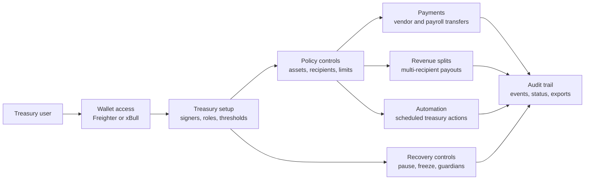

Diagram explanation:

- This diagram shows the product from the treasury user perspective, before introducing implementation modules.
- The user starts with wallet access, configures the treasury account, applies policy controls, and then uses payments, splits, automation, and recovery services.
- All user-facing services produce an audit trail so operational activity can be reviewed after execution.

Key takeaway: STA is not only a payment contract; it is a treasury control system combining wallet access, policy enforcement, automation, recovery, and auditability.

User-facing service model:

| Service | User Value | Technical Enforcement |
|---|---|---|
| Wallet onboarding | Connect with familiar Stellar wallets | Wallets Kit, Freighter/xBull signing, SmartAccount signer records |
| Treasury setup | Define who can operate the account | signer roles, weights, thresholds, policy version |
| Policy controls | Restrict where assets can move | SAC allowlists, destination allowlists, adapter allowlists, spending caps |
| Immediate payments | Pay vendors, payroll, or operational recipients | `execute_interactive`, PolicyEngine, TransferAdapter |
| Revenue splits | Distribute one inflow across multiple recipients | SplitAdapter and per-recipient validation |
| Scheduled execution | Run recurring treasury operations | IntentRegistry child execution IDs and relayer submission |
| Conditional execution | Extension path for future proof-gated payments | ConditionVerifier attestor quorum and replay protection |
| Recovery and freeze | Restore control after key loss or compromise | pause, freeze, guardian threshold, delayed recovery |
| Audit and monitoring | Reconstruct every security-significant action | events, replay records, indexer, dashboards |

### 2.3 Functional Scope

V1 supports the following protocol capabilities:

| Capability | Description | Primary Enforcement Point |
|---|---|---|
| Treasury account creation | Deploy and initialize a SmartAccount with subordinate modules | SmartAccount |
| Signer and threshold management | Configure signer roles, weights, and thresholds | SmartAccount |
| Session keys | Delegate bounded, expiring authority | SmartAccount |
| Asset allowlisting | Restrict treasury assets to approved SAC contracts | SmartAccount and adapters |
| Destination allowlisting | Restrict recipients for treasury movement | SmartAccount |
| Immediate payments | Execute wallet-approved SAC transfers | SmartAccount, PolicyEngine, TransferAdapter |
| Revenue splits | Split one asset transfer across approved recipients | SmartAccount, PolicyEngine, SplitAdapter |
| Scheduled execution | Execute bounded scheduled actions through child execution IDs | SmartAccount, IntentRegistry |
| Conditional execution | Extension-ready proof-gated execution path, outside the core scheduled payment launch flow | SmartAccount, ConditionVerifier |
| Recovery | Freeze, delay, replace signers, and restore safe operation | SmartAccount |

### 2.4 Non-Goals and Boundaries

V1 intentionally excludes:

- arbitrary contract execution from treasury accounts
- unmanaged third-party adapter calls
- non-SAC asset interfaces
- classic Stellar path payments directly from the contract account
- relayer-held owner, management, governance, or recovery authority
- policy changes that silently mutate previously created automation semantics
- unbounded session keys or unbounded automation capabilities

### 2.5 Protocol Actors and Authority Model

| Actor | Authority | Explicit Limitation |
|---|---|---|
| Treasury admin | Configures policies, signers, adapters, destinations, and automations according to threshold rules | Cannot bypass SmartAccount policy or replay protection |
| Treasury operator | Initiates payments, splits, and approved operational actions | Cannot change governance or recovery state unless assigned that role |
| Wallet signer | Signs transaction XDR or authorization material | Cannot authorize actions outside assigned signer role and threshold |
| Session key | Executes bounded delegated actions | Cannot manage signers, policy, adapters, destinations, or recovery |
| Relayer | Pays fees and submits eligible automation transactions | Cannot create or expand authority |
| Attestor | Optional signer for external condition proofs | Cannot trigger execution unless ConditionVerifier quorum and binding checks pass |
| Indexer | Reads events and builds audit views | Cannot be used as execution truth |
| RPC provider | Provides transport, simulation, submission, and transaction status | Cannot be treated as an authority source |

### 2.6 Component Responsibility Matrix

| Component | Primary Responsibility | Must Not Do |
|---|---|---|
| SmartAccount | Root authorization, signer management, policy checks, adapter dispatch, recovery controls | Act as a generic unrestricted executor |
| PolicyEngine | Validate policy version, risk tier, limits, and rule scope | Move funds or own treasury authority |
| IntentRegistry | Maintain parent intents, child execution IDs, replay state, and lifecycle records | Execute treasury actions directly |
| ConditionVerifier | Extension module for attestor quorum, freshness, domain binding, and attestation replay protection | Trust offchain conditions without signature verification |
| Adapters | Execute narrow preauthorized operations such as transfer and split | Expand authority beyond the exact SmartAccount-approved action |
| Relayer | Build, simulate, submit, poll, and index automation transactions | Hold privileged signer keys |
| Frontend | Build readable actions, connect wallets, simulate, sign, submit, and display status | Ask users to sign opaque or policy-ambiguous actions |

## 3. Specification Navigation and Stellar References

### 3.1 How to Read This Architecture

This document follows a layered protocol-specification format:

1. Product and protocol overview: what STA is, who uses it, and which capabilities are in scope.
2. Actor and authority model: which parties exist and what each one can or cannot do.
3. Stellar integration: contract accounts, SAC assets, wallets, RPC, and Lab.
4. Onchain architecture: SmartAccount, policy, intents, verification, recovery, and adapters.
5. Offchain architecture: frontend, wallet integration, relayer, attestors, and indexer.
6. State and execution model: storage records, state machines, and key workflows.
7. Security architecture: trust boundaries, invariants, audit areas, and operational controls.
8. Deployment architecture: local, testnet, and mainnet environment design.

Diagrams use Mermaid so they render directly in GitHub. Tables define authority, component responsibility, requirements, and operational controls.

### 3.2 Diagram Index

- User-facing features and services: Section 2.2
- System context: Section 5.1
- Trust boundary: Sections 5.2 and 13.1
- Onchain contract topology: Section 6.7
- Main smart contract interactions: Section 6.8
- Wallet signing and simulation: Section 8.5
- Frontend module architecture: Section 9.2
- Relayer architecture: Section 10.4
- Intent state machine: Section 11.7
- Execution sequence diagrams: Section 12
- Deployment topology: Section 17.4

### 3.3 External Stellar References

The architecture aligns with the following Stellar documentation and tools:

- Contract accounts: https://developers.stellar.org/docs/build/guides/contract-accounts
- Stellar Asset Contract: https://developers.stellar.org/docs/tokens/stellar-asset-contract
- Scaffold Stellar: https://developers.stellar.org/docs/tools/scaffold-stellar
- Stellar Wallets Kit: https://stellarwalletskit.dev/
- Stellar Wallets Kit signature methods: https://stellarwalletskit.dev/how-to/sign-with-wallet.html
- Freighter wallet integration: https://developers.stellar.org/docs/build/guides/freighter
- Freighter API signing methods: https://docs.freighter.app/docs/guide/usingfreighterwebapp/
- Stellar Lab: https://developers.stellar.org/docs/tools/lab
- RPC `simulateTransaction`: https://developers.stellar.org/docs/data/apis/rpc/api-reference/methods/simulateTransaction

These references establish the core integration assumptions:

- Contract accounts can hold balances and use `__check_auth` to decide who can act and under what conditions.
- SAC is the required path for contracts to interact with Stellar assets.
- Scaffold Stellar provides the development framework for a full-stack Stellar dApp.
- Wallets Kit can connect multiple Stellar wallets, including xBull and Freighter, from one application integration.
- Wallets Kit exposes transaction, authorization-entry, and message signing methods, but wallet modules may differ in which methods they support.
- Freighter supports browser-based Soroban token and smart contract signing flows.
- Freighter explicitly exposes both `signTransaction` and `signAuthEntry` through `@stellar/freighter-api`.
- Stellar Lab can deploy contracts, invoke smart contracts, simulate transactions, inspect XDR, and debug transaction results.
- RPC simulation is required before submission because it calculates transaction data, required authorizations, and resource fees.

## 4. Architecture Decisions

The following decisions remove ambiguity for implementation.

### Decision 1: Wallet-first validation, passkey-capable production architecture

STA uses a staged signer strategy:

1. The testnet validation flow uses Freighter and xBull wallet signing with Ed25519 signer records, plus scoped session keys for delegated operations.
2. The production architecture remains passkey-capable through a P256/WebAuthn signer path in `SmartAccount`.
3. The P256/WebAuthn path requires a focused compatibility spike covering Stellar SDK support, wallet UX, payload normalization, and onchain verification cost.

This decision demonstrates Stellar-native treasury flows with available wallet tooling while preserving the stronger long-term UX promised by contract accounts.

### Decision 2: IntentRegistry is a core module

`IntentRegistry` is required as a first-class module for scheduled and recurring treasury workflows. SmartAccount may store compact capability references for fast authorization checks, but the canonical lifecycle and replay state belongs in `IntentRegistry`.

`IntentRegistry` is part of the core architecture because recurring treasury workflows need:

- parent intent lifecycle
- child execution materialization
- replay-safe execution records
- missed-window handling
- deterministic cancellation and expiry
- auditable execution history
- pruning and retention rules

SmartAccount remains the execution authority, while IntentRegistry is the canonical lifecycle and replay-state module for scheduled and recurring treasury operations.

### Decision 3: Custom minimal relayer for V1

STA uses a custom minimal Node.js relayer for the testnet validation architecture.

The relayer responsibilities are:

- scan eligible execution windows
- build Soroban invocation transactions
- call RPC simulation
- submit transactions
- poll transaction status
- index execution results

OpenZeppelin Relayer or another managed relayer is out of V1 scope. Any relayer implementation MUST preserve the same no-authority trust boundary. A custom relayer gives the team full visibility into Soroban simulation, auth handling, transaction assembly, retries, and replay failure modes during the security-hardening phase.

## 5. System Context

### 5.1 System Context Diagram

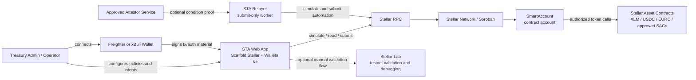

Diagram explanation:

- This diagram shows the external systems that interact with STA and where Stellar infrastructure sits in the architecture.
- Treasury users interact through a wallet and web app; relayers and attestors support automation but do not receive authority over funds.
- All execution reaches the SmartAccount through Stellar RPC and Soroban, and asset movement is routed through SAC contracts.

Key takeaway: user wallets, relayers, attestors, RPC, and Lab are integration surfaces, while SmartAccount and SAC are the onchain enforcement and asset layers.

### 5.2 Trust Boundary Diagram

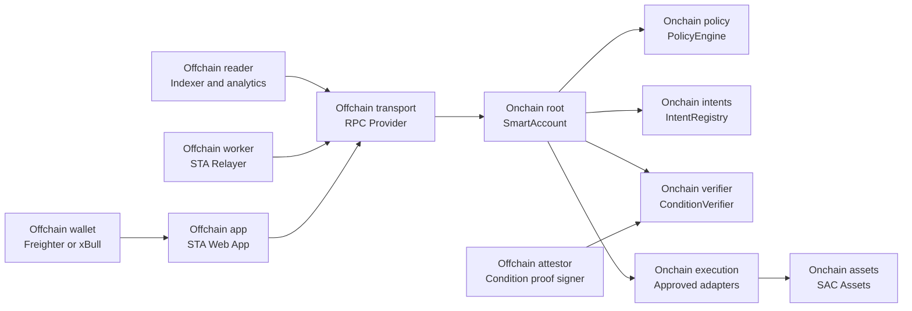

Diagram explanation:

- This diagram separates offchain components from onchain enforcement components.
- Offchain components can prepare, sign, submit, attest, index, and display actions, but they cannot decide whether treasury movement is valid.
- Onchain contracts enforce signer authority, policy, intent replay protection, optional attestation validity, adapter constraints, and asset movement.

Key takeaway: the relayer, RPC provider, indexer, frontend, and attestor services are outside the authority boundary; treasury movement is authorized only by onchain policy.

Diagram zones:

| Zone | Components | Trust Position |
|---|---|---|
| Offchain | Wallet, web app, relayer, indexer, attestor, RPC provider | Can prepare, sign, submit, attest, index, and display actions, but cannot authorize treasury movement |
| Onchain | SmartAccount, PolicyEngine, IntentRegistry, optional ConditionVerifier, approved adapters, SAC assets | Enforces authorization, policy, replay protection, optional condition verification, and asset movement |

Security interpretation:

- Offchain systems can prepare, sign, submit, index, and display actions.
- Offchain systems are not trusted to decide whether treasury movement is valid.
- SmartAccount is the root authority for treasury execution.
- PolicyEngine, IntentRegistry, optional ConditionVerifier, and approved adapters are constrained onchain modules.
- The relayer is intentionally outside the trust boundary and cannot create authority.
- RPC providers and indexers are read/transport dependencies, not policy authorities.

Boundary policy:

| Component | Trust Level | Security Rule |
|---|---:|---|
| SmartAccount | Trusted root | MUST authorize every treasury movement |
| PolicyEngine | Constrained onchain module | MUST validate policy version and rule scope |
| IntentRegistry | Constrained onchain module | MUST enforce intent lifecycle and replay state |
| ConditionVerifier | Optional constrained onchain module | MUST verify quorum, freshness, and proof binding when enabled |
| Approved adapters | Constrained onchain modules | MUST execute only SmartAccount-preauthorized actions |
| Wallets | User-controlled signers | MUST sign bounded payloads; cannot bypass onchain policy |
| Relayer | Untrusted submitter | MUST NOT hold owner, governance, recovery, or management authority |
| RPC provider | Untrusted transport | MUST NOT be treated as an authority source |
| Indexer | Untrusted read model | MUST NOT be used as execution truth |
| Attestor service | Optional semi-trusted input | MUST be verified by ConditionVerifier quorum before execution when proof-gated flows are enabled |

## 6. Onchain Contract Architecture

### 6.1 SmartAccount

`SmartAccount` is the root authority for each treasury wallet.

Responsibilities:

- hold SAC balances
- implement Soroban custom account authorization through `__check_auth`
- store signer records
- store session key scopes
- store account policy pointers
- store allowed asset configuration
- store allowed destination configuration
- store approved adapter configuration
- validate interactive execution
- validate stored automation
- consume child execution IDs
- dispatch to adapters
- coordinate recovery, pause, and freeze controls

The SmartAccount is intentionally not a generic executor. It only routes to approved adapters with known action payloads.

Representative V1 entrypoints:

| Entrypoint | Purpose |
|---|---|
| `initialize(bootstrap_admin, policy_engine, intent_registry, condition_verifier, recovery_manager)` | Configure the account and subordinate module addresses |
| `add_signer(record)` | Add a signer with role, weight, status, and metadata |
| `remove_signer(signer_id)` | Revoke a signer without breaking threshold safety |
| `create_session_key(record, scope)` | Create bounded delegated authority |
| `revoke_session_key(signer_id)` | Revoke a session key |
| `set_asset_config(asset, config)` | Configure an approved SAC asset |
| `set_adapter_config(adapter_id, config)` | Configure an approved execution adapter |
| `set_destination_allowed(destination, allowed)` | Update destination allowlist status |
| `create_automation_capability(capability)` | Store a bounded automation capability |
| `revoke_automation_capability(capability_id)` | Revoke a stored automation capability |
| `execute_interactive(action, expected_policy_version, signer_id)` | Execute a wallet-approved action |
| `execute_automation(capability_id, child_execution_id, optional_proof)` | Execute a scheduled action; optional proof is used only for proof-gated extensions |
| `pause()` / `unpause()` | Disable or restore normal non-emergency execution |
| `freeze()` | Enter emergency frozen state |
| `initiate_recovery(...)` | Start delayed signer or policy recovery |
| `cancel_recovery()` | Cancel pending recovery |
| `finalize_recovery()` | Apply recovery after delay and quorum validation |

### 6.2 PolicyEngine

`PolicyEngine` validates account-level rules that are easier to evolve independently from SmartAccount.

V1 scope:

- current policy version
- allow or block payments
- allow or block adapter actions
- maximum asset risk tier

Extended policy scope:

- per-asset limits
- per-destination limits
- daily and rolling outflow windows
- operation-specific thresholds
- high-risk action escalation
- policy version migration rules
- policy version pinning for stored automation

### 6.3 IntentRegistry

`IntentRegistry` is the canonical intent state machine.

Canonical storage:

- `parent_intent::<intent_id> -> ParentIntent`
- `child_execution::<child_execution_id> -> ChildExecution`
- `intent_usage::<intent_id> -> UsageState`
- `intent_nonce::<account> -> u64`

Canonical responsibilities:

- create parent intents
- activate, cancel, expire, and terminally fail intents
- materialize child execution IDs
- consume child execution records atomically
- prevent replay
- maintain cumulative usage
- prune mature replay records only after deterministic retention rules

### 6.4 ConditionVerifier

`ConditionVerifier` verifies offchain condition proofs for optional proof-gated execution.

Responsibilities:

- store approved attestors
- store attestor threshold
- enforce delayed governance changes
- verify Ed25519 attestor signatures
- bind proofs to SmartAccount, verifier contract, attestation ID, capability ID, and expiry ledger
- reject duplicate attestors
- reject insufficient quorum
- mark attestation IDs consumed

### 6.5 RecoveryManager

`RecoveryManager` is an optional separation module for emergency workflow orchestration.

Recovery controls are anchored in `SmartAccount` in V1:

- pause
- freeze
- delayed recovery plan
- guardian signer support
- signer replacement on recovery finalization
- recovery-mode policy engine replacement
- recovery-mode asset, adapter, destination, and capability lock-down

### 6.6 Execution Adapters

Adapters are deliberately narrow. They do not create authority and MUST require SmartAccount authorization.

V1 adapter set:

- `TransferAdapter`: SAC transfer from SmartAccount to destination.
- `SplitAdapter`: one SAC balance split across approved recipients.

Extension adapters such as swaps or yield strategies are outside the core launch scope and MUST follow the same exact-preauthorization rule before activation.

Adapter security rule: **No adapter may move treasury assets unless SmartAccount has preauthorized the exact operation.**

### 6.7 Onchain Contract Topology

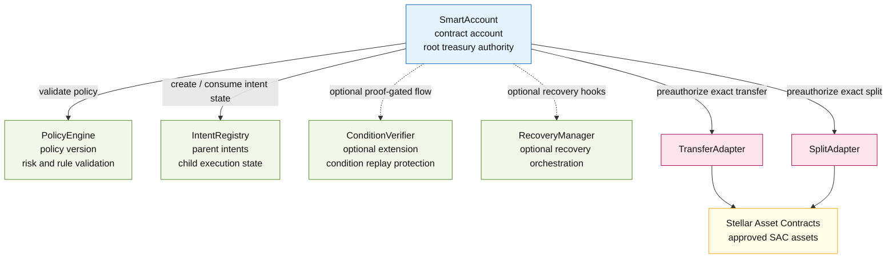

Diagram explanation:

- This diagram shows the full onchain module topology around SmartAccount.
- SmartAccount is the root authority and coordinates policy validation, intent state, optional condition verification, recovery hooks, and adapter dispatch.
- Adapters are placed below SmartAccount because they execute only after SmartAccount has preauthorized an exact action.
- SAC sits at the bottom because all V1 asset movement uses Stellar Asset Contracts.

Key takeaway: subordinate modules and adapters extend SmartAccount behavior, but none of them independently own treasury authority.

Contract topology rules:

- SmartAccount stores or resolves the canonical addresses for subordinate contracts.
- Subordinate contracts MUST never be able to move funds independently.
- Adapters MUST only execute after SmartAccount authorization.
- SAC contracts are the only supported asset interface in v1.

### 6.8 Main Smart Contract Interactions

This diagram focuses only on the onchain contract-to-contract interactions. Offchain wallets, relayers, and indexers are intentionally excluded here.

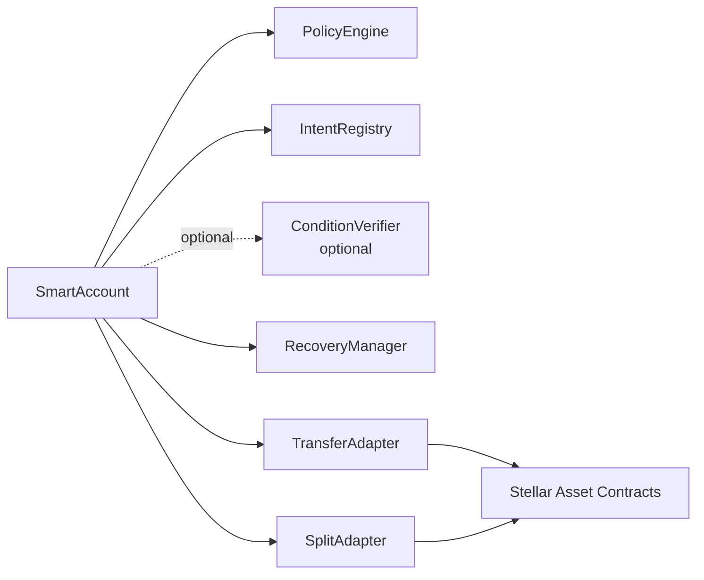

Diagram explanation:

- This diagram focuses only on contract-to-contract calls.
- SmartAccount is the caller that coordinates every security-sensitive module interaction.
- PolicyEngine validates rules, IntentRegistry owns scheduled execution lifecycle and replay state, the optional ConditionVerifier verifies external proofs when enabled, and adapters perform narrow execution against SAC.

Key takeaway: contract interactions are intentionally hub-and-spoke around SmartAccount to keep treasury authorization centralized and auditable.

Interaction rules:

| Interaction | Trigger | Security Rule |
|---|---|---|
| `SmartAccount -> PolicyEngine` | interactive execution, automation execution, policy-sensitive management | Policy version and rule scope MUST be validated before execution |
| `SmartAccount -> IntentRegistry` | automation creation, child execution consumption, cancellation, expiry | Intent lifecycle and replay state MUST be canonical in IntentRegistry |
| `SmartAccount -> ConditionVerifier` | optional proof-gated execution requiring an external proof | Attestor quorum, freshness, domain binding, and attestation replay MUST be verified before execution |
| `SmartAccount -> RecoveryManager` | optional recovery orchestration | Recovery hooks MUST NOT bypass freeze, delay, or quorum rules |
| `SmartAccount -> adapters` | approved payment or split action | Adapters MUST receive exact preauthorized action payloads only |
| `Adapters -> SAC` | token transfer or split transfer | SAC calls MUST use approved assets and SmartAccount-authorized sub-invocations |

Execution ownership:

| Component | Owns | Does Not Own |
|---|---|---|
| SmartAccount | signer authority, root execution decision, adapter dispatch | external condition truth, independent token movement outside SAC |
| PolicyEngine | policy validation and risk rules | signer authority or funds |
| IntentRegistry | intent lifecycle and child execution replay state | treasury execution authority |
| ConditionVerifier | optional attestor verification and attestation replay state | business logic outside the signed proof |
| Adapters | narrow execution mechanics | policy expansion or signer authority |
| SAC | asset balances and token interface | treasury policy |

### 6.9 Contract Governance and Replacement Rules

Contract/module replacement is a high-risk governance action.

Default v1 rule:

- SmartAccount, PolicyEngine, IntentRegistry, ConditionVerifier, and adapter addresses are pinned at SmartAccount initialization unless a delayed governance path is explicitly enabled.

If replacement is enabled, it MUST satisfy all of the following:

- replacement requires governance-role threshold authorization
- replacement is delayed by a configured governance delay
- replacement emits a scheduled event and an applied event
- replacement increments SmartAccount `policy_version` where execution semantics can change
- previously created automation capabilities remain pinned to the policy version and adapter IDs they were created under
- pending child executions cannot silently migrate to a new policy or adapter implementation
- emergency recovery replacement can only occur while the account is frozen or recovery-pending
- UI and relayer MUST refuse to execute stale cached contract addresses after replacement events

Replacement classes:

| Component | Default | Replacement Rule |
|---|---|---|
| SmartAccount | immutable per treasury account | migrate by deploying a new account and moving assets through explicit owner action |
| PolicyEngine | pinned | delayed governance or recovery-mode replacement with policy version bump |
| IntentRegistry | pinned | delayed governance; migration plan MUST preserve parent and child replay state |
| ConditionVerifier | pinned | delayed governance; attestor set version MUST change |
| Adapters | pinned by adapter ID | delayed governance; previously created capabilities remain bound to original adapter ID |
| SAC assets | allowlisted by address | management/governance configuration; no implicit asset substitution |

## 7. Stellar Asset Contract Integration

V1 is SAC-only.

This is a deliberate scope decision:

- contracts interact with Stellar assets through SAC
- each supported asset MUST have an asset contract address
- every asset MUST be explicitly configured in SmartAccount
- every adapter MUST explicitly allow the asset
- unsupported assets fail closed

SAC handling:

- User or issuer deploys the SAC for the asset when no asset contract is available.
- Admin configures the asset in SmartAccount with `AssetConfig`.
- Admin configures adapters with `allowed_assets`.
- Payment and adapter actions reference the SAC contract address.
- SmartAccount calls `authorize_as_current_contract` for exact token transfer sub-invocations.
- Adapter invokes the SAC token client transfer.

Important asset constraints:

- Asset issuers may require authorization.
- Contract balances for issued assets live in contract data.
- Account balances for issued assets live in trust lines.
- Transfers from a contract account to classic accounts use SAC semantics, not classic payment operations.
- V1 does not support arbitrary classic path payments or SDEX orderbook operations from the contract.

## 8. Wallet Integration Architecture

### 8.1 Supported Wallets

Initial wallet focus:

- Freighter
- xBull

Integration library:

- Stellar Wallets Kit

The frontend initializes Wallets Kit with default wallet modules and prioritizes Freighter and xBull in the connection UI. WalletConnect and additional supported wallets can remain available after the primary flows are stable.

Wallet support status:

| Wallet Path | Verified Support | Architecture Requirement |
|---|---|---|
| Freighter via `@stellar/freighter-api` | `signTransaction` and `signAuthEntry` are documented | Freighter can be used for transaction signing and Soroban authorization-entry signing, subject to end-to-end SmartAccount tests |
| Freighter via Wallets Kit | Freighter is a supported Wallets Kit module | Wallets Kit integration MUST preserve access to the required signing method for the active flow |
| xBull via Wallets Kit | xBull is a supported Wallets Kit module | xBull MUST be implementation-tested for the exact `signTransaction` and `signAuthEntry` path required by SmartAccount |
| Any wallet without required auth-entry support | Not sufficient for direct SmartAccount authorization | The only permitted fallback is wallet-approved scoped session key creation with explicit limits |

### 8.2 Wallet Responsibilities

Wallets are responsible for:

- connecting a user account
- returning the active Stellar address
- signing transaction XDRs
- signing Soroban authorization entries when required by the flow
- presenting user-readable transaction prompts when possible

Wallets are not responsible for:

- evaluating treasury policy
- storing automation authority
- acting as relayers
- bypassing SmartAccount authorization

### 8.3 Custom Account Signature Model

STA uses Soroban contract-account authorization. The critical implementation detail is that the wallet or app MUST produce authorization material that matches the SmartAccount `__check_auth` signature type.

Important distinction:

- Transaction signing authorizes submission by the transaction source account.
- Soroban authorization entries authorize contract invocations and are what `__check_auth` verifies for a contract account.
- Freighter's `signAuthEntry` support is documented, but V1 MUST validate the full SmartAccount signing flow end to end.
- xBull is supported through Wallets Kit, but V1 MUST validate the exact xBull support path for auth-entry signing or transaction signing before presenting a flow as xBull-native.
- When a wallet cannot produce the required SmartAccount authorization material, the only permitted fallback is a wallet-approved scoped session key with explicit limits.

The signer model supports three practical signing paths:

1. Wallet Ed25519 signer path
   - Freighter or xBull signs the Soroban transaction or required authorization entry.
   - The SmartAccount signer record stores the wallet public key as an Ed25519 signer.
   - This is the lowest integration-risk validation path because it aligns with available wallet behavior.

2. Passkey/P256 signer path
   - The app creates or registers a passkey credential.
   - The SmartAccount stores a signer record bound to the P256/WebAuthn public key and credential metadata hash.
   - `__check_auth` verifies the P256/WebAuthn assertion or a normalized signed payload.
   - This is the production signer path after the wallet Ed25519 and session-key flows are validated.

3. Scoped session key path
   - A primary signer authorizes creation of a temporary Ed25519 session key.
   - The app or relayer uses that session key only inside the stored scope.
   - The session key cannot manage signers, modify policy, or exceed its asset, destination, adapter, expiry, or amount caps.

For all paths, the signed payload MUST bind:

- network passphrase
- SmartAccount contract address
- function name
- action payload
- signer ID
- policy version
- nonce or execution identifier where applicable
- expiry ledger where applicable

This prevents replay across networks, accounts, policies, and execution contexts.

#### 8.3.1 V1 Signature Envelope

The wallet Ed25519 signer path uses an explicit and versioned SmartAccount signature envelope:

| Field | Type | Binding Purpose |
|---|---|---|
| `domain` | string | Fixed domain separator: `STA_AUTH_V1` |
| `network_passphrase` | string | Prevents cross-network replay |
| `smart_account` | `Address` | Binds signature to one SmartAccount |
| `contract_fn` | `Symbol` | Binds signature to the invoked function |
| `action_hash` | `BytesN<32>` | Commits to the canonical action payload |
| `signer_id` | `BytesN<32>` | Identifies the signer record |
| `policy_version` | `u32` | Prevents stale-policy execution |
| `nonce_or_execution_id` | `BytesN<32>` | Prevents replay within the account |
| `expires_ledger` | `u32` | Limits signature lifetime |

Signing flow:

1. The app builds the Soroban invocation and derives `action_hash` from the canonical XDR/Soroban value representation of the action payload.
2. The app simulates the transaction with RPC `authMode = record` to collect required authorization data and resource information.
3. The app asks Freighter or xBull to sign the transaction XDR or the required authorization entry when supported by the wallet.
4. For session-key and non-wallet signer flows, the app signs `StaAuthEnvelopeV1` directly with the relevant Ed25519 key.
5. The submitted SmartAccount signature payload MUST match the signer record stored onchain.

Wallet compatibility rule:

- V1 MUST support the simplest wallet path that works reliably with Freighter and xBull: user wallet signs the Soroban transaction/auth material, while SmartAccount signer records bind the wallet public key.
- If a wallet cannot expose the required auth-entry signing path for a specific SmartAccount flow, V1 falls back to wallet-authorized creation of a scoped session key and uses that session key for bounded execution.
- No fallback may give broader authority than the user-approved session scope.
- The frontend MUST label the active signing path in the review screen: wallet auth entry, transaction signature, or scoped session key.

### 8.4 Frontend Signing Flow

Interactive execution flow:

1. User connects Freighter or xBull through Wallets Kit.
2. App fetches SmartAccount status and policy state from RPC.
3. User creates a payment or split action.
4. App builds the `execute_interactive` invocation.
5. App simulates the transaction with RPC.
6. Simulation returns required auth entries, resource fee, and transaction data.
7. App asks the wallet to sign the transaction, required authorization entry, or `StaAuthEnvelopeV1` depending on signer path.
8. Signed XDR is submitted by the wallet, app backend, or relayer.
9. SmartAccount validates `__check_auth`, policy, adapter constraints, and dispatches.
10. UI shows event-derived execution status.

Automation creation flow:

1. User connects wallet.
2. User defines an automation envelope.
3. App shows policy summary: assets, recipients, amount caps, execution window, max executions.
4. User signs creation of the bounded capability.
5. SmartAccount stores `AutomationCapabilityState`.
6. Authorized relayer submissions can trigger only within the stored capability envelope.

Automation execution flow:

1. Relayer detects eligible child execution window.
2. Relayer builds `execute_automation`.
3. Relayer includes optional proof only when a proof-gated extension is enabled.
4. Transaction is simulated.
5. Relayer submits transaction.
6. SmartAccount validates capability, policy version, execution window, child ID, optional proof if required, and policy.
7. SmartAccount dispatches the adapter call.
8. Child execution ID is marked consumed.

### 8.5 Wallet Signing and Simulation Diagram

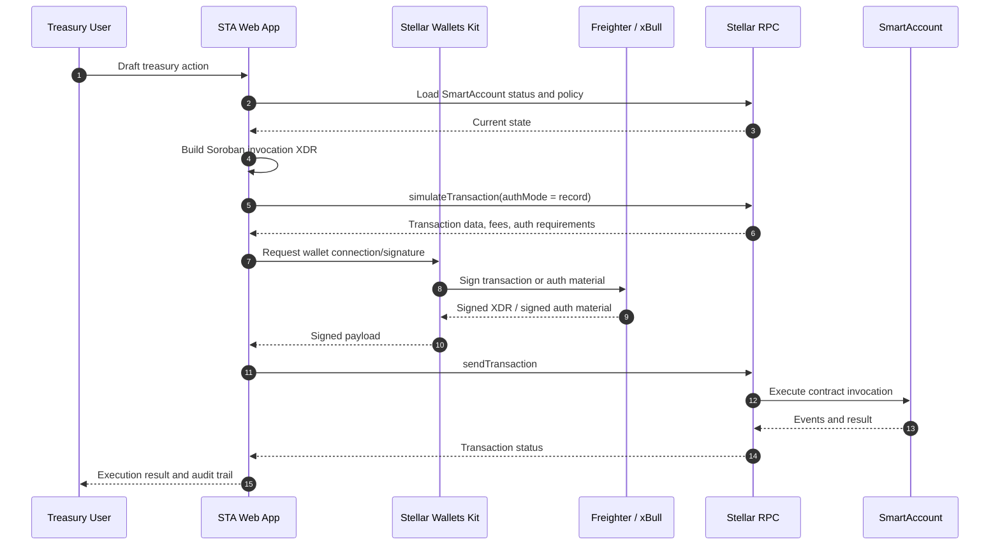

Diagram explanation:

- This sequence shows the safe order for wallet-driven execution.
- The app loads state, builds the Soroban invocation, simulates it, requests wallet approval, submits the signed transaction, and then displays the confirmed event-derived result.
- Simulation happens before signing so the user can review expected authorization requirements, fees, and transaction data.

Key takeaway: the user signs only after the action has been built and simulated; final execution still depends on SmartAccount authorization and policy validation.

Signing rule:

- The app MUST simulate before signing.
- The signed payload MUST bind the network, SmartAccount address, action payload, signer ID, policy version, and expiry or execution identifier.
- The wallet UX SHOULD show a human-readable summary of the action before requesting signature.

## 9. Frontend and Testnet Validation Framework

### 9.1 Scaffold Stellar

The testnet validation frontend uses Scaffold Stellar as the starting framework.

Reference: https://developers.stellar.org/docs/tools/scaffold-stellar

Rationale:

- Rust contract workspace compatibility
- modern frontend structure
- generated TypeScript clients
- environment configuration for local, testnet, and mainnet targets
- faster path from contract interfaces to usable UI

Scaffold setup path:

```bash
cargo install --locked stellar-scaffold-cli
cargo install --locked stellar-registry-cli
stellar scaffold init sta-app
cd sta-app
npm start
```

STA uses Scaffold Stellar for the application shell and contract-client workflow. The frontend package can live under `app/` in a monorepo or be initialized as a sibling package and then migrated into a workspace once the contract interfaces stabilize.

Reference application structure:

```plaintext
app/
  src/
    components/
      AccountSelector.tsx
      TreasuryDashboard.tsx
      PolicyEditor.tsx
      SignerManager.tsx
      SessionKeyManager.tsx
      IntentBuilder.tsx
      ExecutionQueue.tsx
      RecoveryPanel.tsx
    contracts/
      smartAccountClient.ts
      policyEngineClient.ts
      intentRegistryClient.ts
      conditionVerifierClient.ts
      adapterClients.ts
    stellar/
      walletKit.ts
      rpc.ts
      transactionBuilder.ts
      simulation.ts
      xdr.ts
    routes/
      dashboard.tsx
      account-create.tsx
      policies.tsx
      intents.tsx
      recovery.tsx
  environments.toml
```

Environment configuration:

```yaml
local:
  network_passphrase: "local sandbox network"
  rpc_url: "local quickstart RPC"
  contracts: "contract IDs produced by local deployment scripts"

testnet:
  network_passphrase: "Test SDF Network ; September 2015"
  rpc_url: "Stellar testnet RPC provider"
  contracts: "contract IDs produced by testnet deployment scripts"

mainnet:
  network_passphrase: "Public Global Stellar Network ; September 2015"
  rpc_url: "production RPC provider"
  contracts: "release-verified contract IDs produced by controlled mainnet deployment"
```

Generated client responsibilities:

- encode Soroban contract arguments for SmartAccount and subordinate contracts
- build invocation transactions for setup and execution flows
- fetch read-only status snapshots
- call simulation before wallet signing
- decode result XDR and error codes for UI display

Frontend integration steps:

1. Initialize Scaffold Stellar app.
2. Add Wallets Kit connection and network state.
3. Generate or hand-wrap TypeScript clients for the architecture contracts.
4. Add SmartAccount setup screens.
5. Add transaction simulation and signing utility.
6. Add execution dashboards for payment, split, automation, and recovery flows.

### 9.2 Frontend Module Architecture

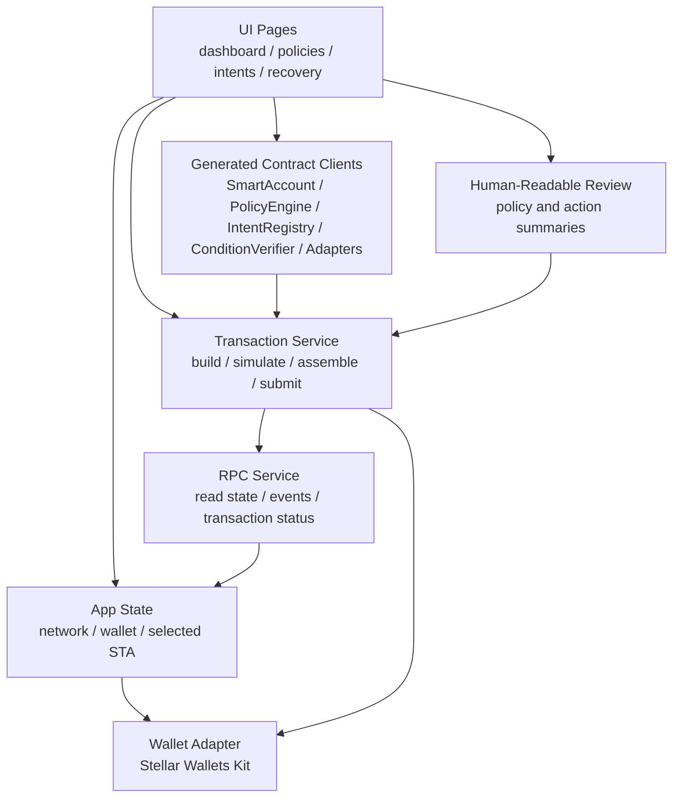

Diagram explanation:

- This diagram shows the frontend modules needed for a safe treasury application.
- UI pages do not submit directly; they depend on generated contract clients, transaction services, wallet adapters, RPC services, and human-readable review summaries.
- The human-readable review component is part of the architecture because users must understand asset, amount, destination, adapter, signer, expiry, and policy version before signing.

Key takeaway: the frontend is a safety layer as well as a user interface; it must make contract actions understandable before wallet approval.

Frontend safety requirements:

- Always show asset, amount, destination, adapter, expiry, policy version, and signer before signing.
- Never ask the wallet to sign opaque XDR without a decoded summary.
- Treat RPC responses as untrusted until confirmed by transaction result and events.
- Cache only read models; never cache authority.
- Keep network passphrase visible in developer/testnet builds to prevent wrong-network signing.

### 9.3 Stellar Lab Validation Flow

Stellar Lab is used for validation, manual invocation, and demos.

Lab usage:

- create and fund testnet accounts
- deploy contract WASM files
- deploy SAC instances for test assets if needed
- invoke SmartAccount setup functions
- simulate `execute_interactive`
- inspect XDR
- inspect failed transaction metadata
- share saved API requests and transaction examples

The Lab flow provides a reproducible, browser-based way to inspect contract behavior before a complete frontend is finished.

## 10. Offchain Services

### 10.1 Relayer

The relayer is a submitter, not an authority.

Responsibilities:

- monitor eligible scheduled execution windows
- build `execute_automation` transactions
- simulate transactions
- pay transaction fees
- submit automation trigger transactions for preauthorized capabilities
- report execution status to UI

The relayer cannot:

- create signers
- create automation capabilities
- expand execution scope
- change policy
- bypass replay protection
- move funds outside SmartAccount policy

Relayer implementation requirements:

- testnet validation uses a custom Node.js service with Stellar SDK and RPC
- mainnet operation requires a hosted worker with queue, retry logic, execution locks, and monitoring
- any managed relayer replacement MUST preserve the same no-authority trust boundary

### 10.2 Optional Attestor Service

The attestor service signs external condition proofs for future proof-gated execution flows. It is extension-ready and is not required for the core scheduled payment launch flow.

Examples:

- invoice approved
- shipment delivered
- deliverable accepted
- compliance approval received
- marketplace payout window closed

Attestor proof requirements:

- domain string: `STA_CONDITION_ATTESTATION_V1`
- network passphrase
- smart account address
- verifier contract address
- attestor set version
- attestation ID
- capability ID
- condition payload hash
- expiry ledger
- attestor Ed25519 signature

Only approved attestors count toward quorum.

The signed attestation payload is:

| Field | Type | Binding Purpose |
|---|---|---|
| `domain` | string | Fixed domain separator: `STA_CONDITION_ATTESTATION_V1` |
| `network_passphrase` | string | Prevents cross-network replay |
| `smart_account` | `Address` | Binds proof to one treasury account |
| `condition_verifier` | `Address` | Binds proof to one verifier deployment |
| `attestor_set_version` | `u32` | Prevents replay from retired attestor sets |
| `attestation_id` | `BytesN<32>` | Unique proof identifier consumed once |
| `capability_id` | `BytesN<32>` | Binds proof to one automation capability |
| `condition_payload_hash` | `BytesN<32>` | Commits to the external business fact |
| `expires_ledger` | `u32` | Limits proof lifetime |

Attestation rules:

- `condition_payload_hash` MUST commit to the business fact being attested, such as invoice ID, deliverable ID, payer/payee, amount, asset, and approval metadata hash.
- `attestor_set_version` prevents proofs from an old attestor set from being replayed after governance changes.
- `network_passphrase` prevents cross-network replay.
- The verifier contract address prevents reuse across verifier deployments.
- The attestation ID MUST be consumed once and only once.

### 10.3 Indexer and Event Consumer

The testnet validation service can read RPC events directly. A production service SHOULD index:

- account initialization
- signer changes
- policy changes
- session creation and revocation
- intent creation and cancellation
- automation execution
- attestation consumption when proof-gated execution is enabled
- recovery actions
- adapter execution records

This powers:

- dashboard history
- audit exports
- monitoring alerts
- execution reconciliation

### 10.4 Relayer Architecture

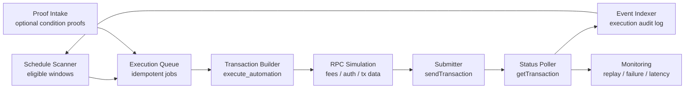

Diagram explanation:

- This diagram shows the relayer as a job processor for already-authorized automation.
- The relayer scans schedules, queues idempotent jobs, builds transactions, simulates them, submits them, polls status, indexes events, and raises monitoring alerts. Optional proof intake can be added for proof-gated flows.
- The feedback from indexing to scheduling helps prevent repeated attempts after a child execution has settled.

Key takeaway: the relayer improves automation reliability but remains a submitter only; replay protection and execution authority remain onchain.

Relayer safety requirements:

- Every job MUST be idempotent by `child_execution_id`.
- The relayer MUST simulate before submit.
- The relayer MUST NOT hold owner, management, governance, or recovery keys.
- The relayer MUST only submit `execute_automation` for preauthorized capabilities.
- Retry logic MUST distinguish temporary RPC failures from terminal policy failures.
- Duplicate submissions MUST fail safely through onchain replay checks.

## 11. Core State Model

### 11.1 SignerRecord

| Field | Type | Description |
|---|---|---|
| `signer_id` | `BytesN<32>` | Stable signer identifier |
| `signer_kind` | <code>Ed25519 &#124; PasskeyP256 &#124; PolicySigner &#124; SessionKey &#124; Guardian</code> | Signer verification path |
| `role_bitmap` | `u32` | Assigned roles |
| `status` | <code>Active &#124; Revoked &#124; Expired</code> | Signer lifecycle state |
| `weight` | `u32` | Weight used for threshold checks |
| `created_ledger` | `u32` | Creation ledger |
| `expires_ledger` | `Option<u32>` | Optional expiry ledger |
| `metadata_hash` | `BytesN<32>` | Hash of signer metadata |

Roles:

- payment spend
- adapter spend
- management
- governance
- recovery
- session default

### 11.2 SessionScope

| Field | Type | Description |
|---|---|---|
| `allowed_action_bitmap` | `u32` | Action types allowed by the session |
| `allowed_assets` | `Vec<Address>` | SAC assets allowed by the session |
| `allowed_destinations` | `Vec<Address>` | Recipients allowed by the session |
| `allowed_adapters` | `Vec<BytesN<32>>` | Adapters allowed by the session |
| `per_execution_cap` | `i128` | Maximum amount per execution |
| `cumulative_cap` | `i128` | Maximum total amount across the session |
| `consumed_amount` | `i128` | Amount already consumed |
| `expiry_ledger` | `u32` | Session expiry ledger |
| `single_use` | `bool` | Whether the session revokes after one use |

Session keys MUST be bounded, expiring, and non-escalating.

### 11.3 AssetConfig

| Field | Type | Description |
|---|---|---|
| `enabled` | `bool` | Whether the SAC asset is usable |
| `risk_tier` | `u32` | Asset risk tier used by policy |
| `max_single_transfer` | `i128` | Maximum amount per transfer |

### 11.4 AdapterConfig

| Field | Type | Description |
|---|---|---|
| `adapter_address` | `Address` | Contract address for the adapter |
| `enabled` | `bool` | Whether the adapter can be used |
| `adapter_type` | <code>payment &#124; split</code> | V1 adapter operation class |
| `max_single_execution_amount` | `i128` | Maximum amount per adapter execution |
| `allowed_assets` | `Vec<Address>` | SAC assets allowed for this adapter |
| `max_split_recipients` | `u32` | Maximum recipients in one split |

### 11.5 AutomationCapability

| Field | Type | Description |
|---|---|---|
| `capability_id` | `BytesN<32>` | Stable capability identifier |
| `parent_intent_id` | `BytesN<32>` | Parent intent that owns the capability |
| `action` | `InteractiveAction` | Bounded action to execute |
| `required_attestation_id` | `Option<BytesN<32>>` | Optional extension field for proof-gated execution |
| `policy_version` | `u32` | Policy version pinned at creation |
| `executable_from_ledger` | `u32` | First eligible execution ledger |
| `executable_until_ledger` | `u32` | Last eligible execution ledger |
| `max_executions` | `u32` | Maximum number of executions |

### 11.6 ChildExecution

Required fields:

| Field | Type | Description |
|---|---|---|
| `child_execution_id` | `BytesN<32>` | Unique execution identifier |
| `parent_intent_id` | `BytesN<32>` | Parent intent reference |
| `capability_id` | `BytesN<32>` | Capability being executed |
| `status` | <code>Pending &#124; ConsumedInProgress &#124; Executed &#124; Skipped &#124; Cancelled &#124; FailedTerminal</code> | Execution lifecycle state |
| `execution_window_start` | `u32` | First eligible ledger |
| `execution_window_end` | `u32` | Last eligible ledger |
| `attempt_count` | `u32` | Number of execution attempts |
| `settled_ledger` | `Option<u32>` | Ledger where the execution reached a terminal state |

### 11.7 Intent State Machine

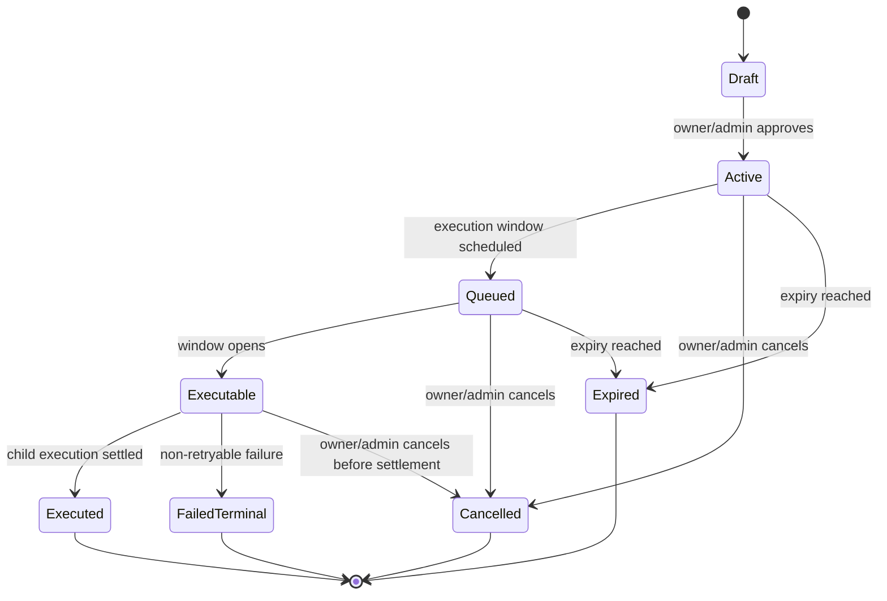

Diagram explanation:

- This state machine defines how intents and child executions move from creation to settlement.
- Draft and Active states represent approved intent setup; Queued and Executable represent timing eligibility; terminal states prevent ambiguous replay.
- FailedTerminal is reserved for non-retryable failures, while missed windows can be skipped according to deterministic rules.

Key takeaway: scheduled execution is controlled by explicit lifecycle state, not by relayer memory or offchain assumptions.

Intent rules:

- Terminal states are `Executed`, `Cancelled`, `Expired`, and `FailedTerminal`.
- A recurring parent intent may produce many child executions, but each child execution can settle only once.
- Missed windows default to skip unless the parent intent explicitly allows safe catch-up behavior.
- Cumulative caps are tracked at the parent intent level and MUST survive pruning of mature child records.

## 12. Key Workflows

### 12.1 Create a Smart Treasury Account

1. Deploy SmartAccount.
2. Deploy PolicyEngine.
3. Deploy IntentRegistry.
4. Deploy ConditionVerifier only when proof-gated execution is enabled.
5. Deploy adapters.
6. Initialize SmartAccount with subordinate contract addresses.
7. Add primary signer.
8. Configure management/governance/recovery thresholds.
9. Configure approved SAC assets.
10. Configure approved adapters.
11. Configure destination allowlist.
12. Transfer treasury assets into SmartAccount SAC balance.

### 12.2 Immediate Vendor Payment

1. Operator selects approved SAC asset and destination.
2. App builds PaymentAction.
3. App simulates `execute_interactive`.
4. Wallet signs.
5. SmartAccount validates signer role and policy version.
6. SmartAccount checks asset enabled, amount cap, destination allowlist, adapter config.
7. SmartAccount preauthorizes exact SAC transfer.
8. TransferAdapter invokes SAC transfer.
9. Event emitted and UI updates.

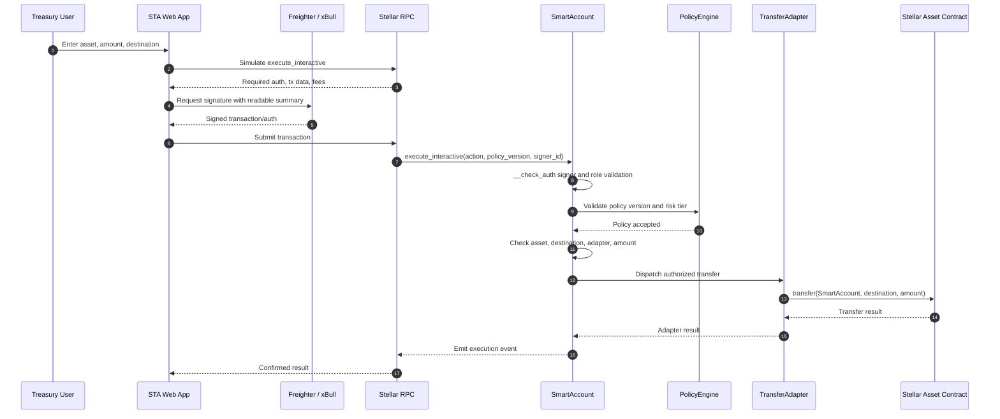

Diagram explanation:

- This sequence shows an immediate SAC payment initiated by a treasury user.
- The app simulates before requesting wallet signature; SmartAccount then validates signer authority, policy version, asset, destination, adapter, and amount before dispatching to TransferAdapter.
- TransferAdapter performs the SAC transfer only after SmartAccount authorization.

Key takeaway: even a simple vendor payment passes through signer validation, policy validation, adapter authorization, and SAC execution.

### 12.3 Scoped Session Key

1. Admin creates session key record.
2. Admin defines session scope.
3. SmartAccount validates bounded scope.
4. Session key can execute only matching interactive actions.
5. Consumed amount is updated after execution.
6. Session is revoked automatically if single-use or cumulative cap is reached.

### 12.4 Scheduled Payment

1. Admin creates parent intent.
2. SmartAccount authorizes creation of a bounded capability.
3. IntentRegistry stores the parent intent and future child windows.
4. Relayer detects eligible window.
5. Relayer submits `execute_automation`.
6. SmartAccount validates child execution ID is unused.
7. SmartAccount validates capability window and policy version.
8. SmartAccount dispatches transfer.
9. IntentRegistry records child execution settlement and replay status.

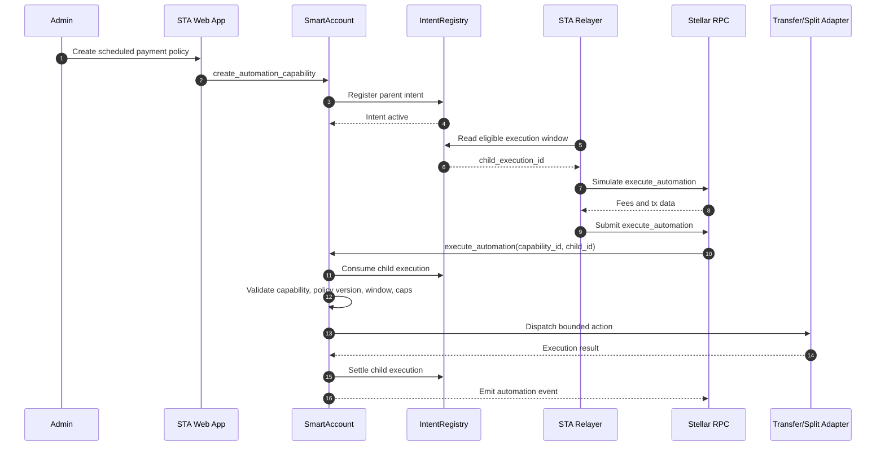

Diagram explanation:

- This sequence shows scheduled execution after a bounded automation capability has been created.
- The relayer reads an eligible child execution, simulates the automation call, and submits it, but SmartAccount and IntentRegistry decide whether the child execution is valid and unused.
- IntentRegistry records settlement so the same child execution cannot be replayed.

Key takeaway: scheduled execution is relayer-triggered but onchain-authorized and replay-protected.

### 12.5 Optional Proof-Gated Payment Extension

This workflow is an extension path for proof-gated payments. It is not required for the core scheduled payment launch flow.

1. Admin creates a capability requiring an external proof.
2. External condition occurs.
3. Approved attestor signs proof.
4. Relayer submits proof with `execute_automation`.
5. ConditionVerifier verifies freshness, quorum, uniqueness, and binding.
6. SmartAccount executes approved action.
7. Attestation and child execution are consumed.


Diagram explanation:

- This sequence shows an optional automation extension that requires an external condition proof.
- The attestor signs a proof, the relayer submits it, and ConditionVerifier checks quorum, expiry, binding, and replay before SmartAccount dispatches the payment.
- The proof and child execution are consumed so the same condition cannot be reused.

Key takeaway: proof-gated payments depend on onchain proof verification, not on relayer trust or frontend state, and remain separate from the core scheduled payment flow.

### 12.6 Revenue Split

1. Admin configures recipients and caps.
2. App builds SplitAction with exact recipient amounts.
3. SmartAccount validates asset, adapter, recipients, duplicate destinations, and total amount.
4. SplitAdapter transfers exact SAC amounts to recipients.
5. Execution result is indexed for audit.

### 12.7 Recovery

1. Guardian or recovery quorum triggers freeze.
2. Frozen account blocks normal execution.
3. Recovery plan is initiated with new signers and thresholds.
4. Recovery delay MUST elapse.
5. Recovery quorum finalizes plan.
6. Old signers and sessions are cleared.
7. New signers are installed.
8. Policy version increments.
9. Account unfreezes.

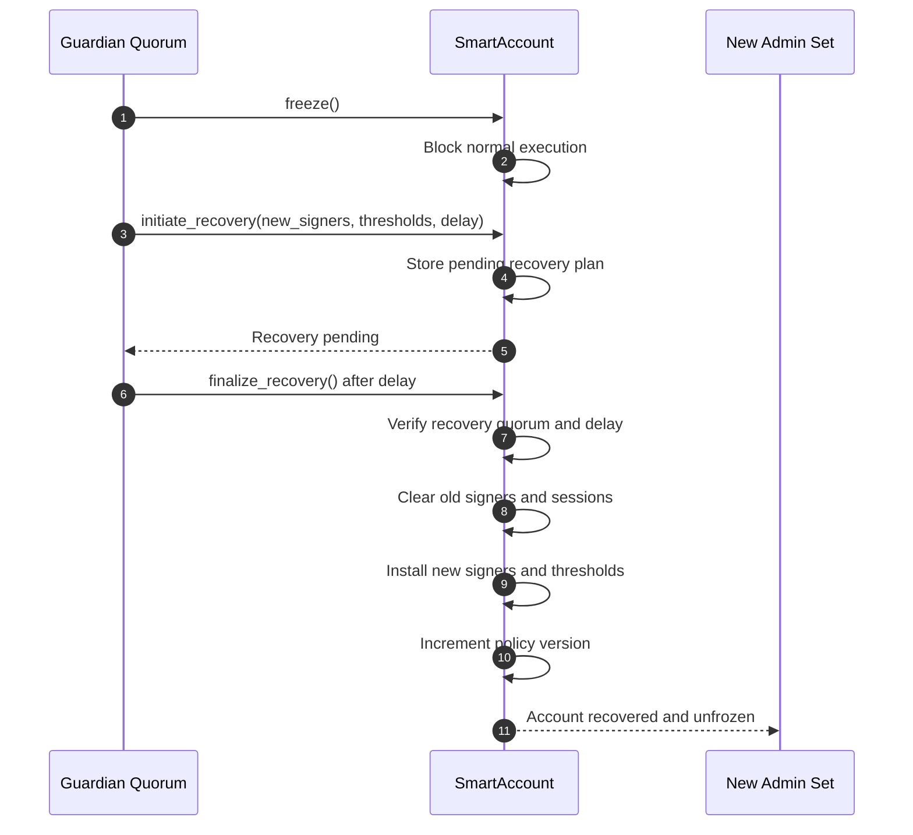

Diagram explanation:

- This sequence shows emergency recovery after freeze.
- Normal execution is blocked first, then a delayed recovery plan is initiated, verified, finalized, and applied.
- Old signers and sessions are cleared before new authority is installed and the policy version increments.

Key takeaway: recovery is intentionally slower and stricter than normal spend flows because it can replace account authority.

## 13. Security Architecture

### 13.1 Trust Boundaries

Trusted onchain root:

- SmartAccount contract code

Constrained onchain modules:

- PolicyEngine
- IntentRegistry
- ConditionVerifier when proof-gated execution is enabled
- approved adapters
- approved SAC assets

Untrusted or semi-trusted offchain components:

- frontend
- relayer
- RPC provider
- indexer
- attestor service until quorum verified onchain, when proof-gated execution is enabled
- wallet UI display layer

Critical rule: **Offchain components may prepare, submit, display, and monitor actions, but only onchain policy can authorize treasury movement.**

### 13.2 Security Invariants

The following invariants MUST hold at all times:

- SmartAccount is the only contract that can authorize treasury value movement.
- Adapters cannot move funds without SmartAccount authorization.
- A session key cannot execute outside its stored scope.
- A relayer cannot create or expand authority.
- A stored automation cannot execute outside its capability envelope.
- A child execution ID cannot be consumed twice.
- A required attestation cannot be reused when proof-gated execution is enabled.
- A frozen account cannot execute normal treasury actions.
- Recovery cannot reduce signer safety below configured thresholds.
- Policy version changes cannot silently mutate previously created automation semantics.
- Unsupported assets fail closed.
- Disabled adapters fail closed.
- Destinations default to disallowed.

### 13.3 Security Review Matrix

The following matrix defines the security areas that require focused implementation review. Each row links a protocol surface to the failure mode it protects against and the verification expected before deployment.

| Review Area | Primary Risk | Required Verification |
|---|---|---|
| Contract-account authorization | Invalid signer, wrong account context, or replayed authorization accepted by `__check_auth` | Verify network, SmartAccount address, function, action hash, signer ID, policy version, nonce or execution ID, and expiry binding |
| Signature aggregation | Duplicate signatures, invalid ordering, or incorrect weight counting satisfies a threshold | Test duplicate rejection, deterministic signer ordering, role-specific weights, and threshold edge cases |
| Signer management | Removing or replacing signers leaves the account below required safety thresholds | Test signer addition, revocation, threshold updates, and signer removal invariants |
| Session keys | Delegated key exceeds intended authority | Test action type, asset, destination, adapter, expiry, per-execution cap, cumulative cap, and single-use restrictions |
| Session accounting | Consumed amount is undercounted or reset unexpectedly | Test cumulative accounting across successful, failed, repeated, and boundary-value executions |
| Adapter preauthorization | Adapter moves assets beyond the exact SmartAccount-approved action | Verify adapter ID, action type, asset, destination, amount, slippage, recipient list, and strategy parameters before dispatch |
| Policy version pinning | A policy change silently changes previously approved automation behavior | Test policy-version mismatch, policy migration, and stale execution rejection |
| Automation replay protection | Scheduled or recurring execution runs more than once for the same child execution ID | Test child execution consumption, terminal states, duplicate submissions, and retry behavior |
| Attestation proof binding | A condition proof is reused across accounts, networks, capabilities, or verifier deployments | Required only when proof-gated execution is enabled: verify domain, network passphrase, SmartAccount, verifier address, attestor set version, attestation ID, capability ID, payload hash, and expiry |
| Recovery transitions | Recovery bypasses normal controls or installs unsafe signer thresholds | Test freeze, pause, recovery initiation, cancellation, delay enforcement, finalization, and post-recovery threshold safety |
| Pause and freeze controls | Normal execution remains possible during emergency states | Test every execution and management entrypoint while paused, frozen, or recovery-pending |
| Storage TTL and archival | Critical signer, policy, intent, or replay state expires or becomes unavailable | Test TTL extension paths, restore handling, maintenance permissions, and prune maturity rules |
| Amount arithmetic | Overflow, sign errors, or precision mistakes affect treasury balances or limits | Test `i128` validation, non-negative amounts, maximum values, cumulative caps, split totals, and slippage basis points |
| Allowlists | Unsupported assets, destinations, or adapters pass validation | Test fail-closed behavior for missing, disabled, stale, or replaced asset and adapter configuration |

### 13.4 Security Assurance Requirements

The implementation MUST include verification evidence for the security model.

| Assurance Area | Required Evidence |
|---|---|
| Authorization | Unit and integration tests for `__check_auth`, signer binding, duplicate signatures, signer weights, and role thresholds |
| Session scope | Tests proving sessions cannot exceed action, asset, destination, adapter, amount, expiry, or single-use limits |
| Policy enforcement | Tests for asset allowlists, destination allowlists, adapter allowlists, policy version pinning, and failed-closed defaults |
| Replay protection | Tests proving child execution IDs cannot be reused; attestation replay tests are required when proof-gated execution is enabled |
| Adapter dispatch | Tests proving adapters only execute exact SmartAccount-preauthorized actions |
| Recovery | Tests for pause, freeze, delayed recovery, cancellation, finalization, and threshold safety after signer replacement |
| RPC and simulation | Integration tests for build, simulate, sign, assemble, submit, poll, and event decoding flows |
| TTL and storage | Tests and maintenance runbooks for critical state extension, pruning maturity, and archival handling |
| Events | Event assertions for every security-significant state transition |
| Deployment | Reproducible scripts that publish contract IDs, WASM hashes, network passphrase, policy version, and adapter IDs |

The audit baseline SHOULD include:

- deterministic unit tests for each contract module
- cross-contract integration tests for payment, split, scheduled execution, and recovery
- negative tests for all fail-closed paths
- property or invariant tests for replay protection, thresholds, and cumulative caps
- manual Stellar Lab reproduction steps for the critical flows

### 13.5 Known Design Risks and Mitigations

| Risk | Mitigation |
|---|---|
| Relayer submits malicious action | Onchain policy validates exact action and relayer has no authority |
| Session key abuse | Session scopes bind action type, assets, destinations, adapters, caps, and expiry |
| Replay of scheduled execution | Child execution IDs are stored as consumed |
| Replay of external condition | Optional ConditionVerifier stores consumed attestation IDs when proof-gated execution is enabled |
| Policy migration changes old automations | Automation capabilities pin policy version |
| Adapter escape hatch | SmartAccount validates adapter type, enabled status, asset allowlist, and limits before dispatch |
| Frozen account bypass | Execution entrypoints call active-state checks |
| Governance compromise | Role separation, weighted thresholds, delayed governance for verifier changes |
| Asset issuer restrictions | SAC authorization and trustline behavior are treated as deployment prerequisites |
| State archival | TTL extension and monitoring are required for production operation |

## 14. RPC, Simulation, and Transaction Submission

All smart contract execution MUST be simulated before submission.

RPC simulation constraint:

- `simulateTransaction` is used for contract invocation transactions.
- Each simulated transaction MUST contain a single `invokeHostFunction` operation.
- Multi-step user workflows MUST be decomposed into separately simulated contract invocations or explicitly assembled as one contract invocation that orchestrates the required internal sub-calls.
- The client MUST use the returned authorization entries, resource fee, and Soroban transaction data when assembling the final transaction.
- If simulation returns a restore preamble for archived ledger entries, the client or operator MUST restore the footprint before submitting the intended invocation.

Simulation responsibilities:

- calculate required transaction data
- calculate minimum resource fee
- identify required authorization entries
- detect policy and auth failures before wallet prompt
- prepare final XDR for signing

Recommended client flow:

1. Build transaction.
2. Call `simulateTransaction(authMode = record)` when collecting authorization requirements.
3. Assemble the transaction with returned transaction data and resource fees.
4. Request wallet signature.
5. Call `simulateTransaction(authMode = enforce)` after signatures or authorization entries are assembled.
6. Submit transaction with `sendTransaction`.
7. Poll status with `getTransaction`.
8. Index emitted events.

Simulation MUST be part of:

- immediate payments
- adapter actions
- signer management
- policy updates
- automation creation
- automation execution
- recovery actions

Simulation mode rule:

- Use `record` mode only to discover authorization requirements and prepare signing material.
- Use `enforce` mode after signatures or authorization entries are assembled to catch auth and policy failures before final submission where wallet/tooling support permits.
- If a wallet cannot support an enforce-mode pre-submit round trip, the UI MUST clearly mark the transaction as “simulated for auth collection; final validation occurs on submission” and show the exact onchain failure if submission is rejected.

## 15. Events and Observability

Events MUST be emitted for every security-significant action:

- account initialized
- signer added or removed
- threshold changed
- session key created or revoked
- asset configured
- adapter configured
- destination allowlist changed
- intent created or cancelled
- automation capability created or revoked
- interactive execution succeeded
- automation execution succeeded
- attestation consumed when proof-gated execution is enabled
- account paused, unpaused, or frozen
- recovery initiated, cancelled, or finalized
- policy version changed

Operational monitoring SHOULD alert on:

- failed auth attempts
- repeated replay attempts
- frozen or paused state
- high-value execution
- policy version changes
- verifier threshold changes
- signer set changes
- TTL nearing archival threshold

## 16. Storage and TTL Strategy

Persistent storage is required for:

- initialization state
- signer records
- session scopes
- threshold totals
- asset configs
- adapter configs
- destination allowlists
- automation capabilities
- child execution consumption
- pending recovery plans
- policy version
- attestor approvals when proof-gated execution is enabled
- consumed attestation IDs when proof-gated execution is enabled

Production requirements:

- extend TTL on successful state-changing calls touching critical entries
- provide explicit maintenance methods for TTL extension
- monitor low TTL for signer state, recovery state, active intents, and replay records
- define pruning rules for mature child execution records, plus attestation records when proof-gated execution is enabled
- never prune records before deterministic replay-safety windows expire

### 16.1 TTL Maintenance Methods

Maintenance entrypoints:

| Entrypoint | Purpose |
|---|---|
| `extend_account_ttl(targets)` | Extend TTL for account-level critical state |
| `extend_intent_ttl(parent_intent_id, child_range)` | Extend TTL for parent intent and selected child execution records |
| `extend_attestation_ttl(attestation_ids)` | Extend TTL for consumed attestation records when proof-gated execution is enabled |
| `extend_policy_ttl()` | Extend TTL for policy and rule configuration |
| `prune_replay_state(parent_intent_id, mature_range)` | Prune mature replay state after retention conditions are satisfied |

Permission model:

- Owner, management quorum, or governance quorum can extend all critical TTL targets.
- Permissionless TTL extension is allowed for non-mutating maintenance of clearly identified public targets, such as active intent records or consumed replay records, because extending TTL does not create authority or alter execution semantics.
- Pruning replay state is permissionless only after deterministic maturity conditions are satisfied.
- Pruning MUST never reduce parent intent cumulative counters or make a child execution replayable.

Critical TTL targets:

| State | TTL Handling |
|---|---|
| signer records | extend on auth, signer management, and maintenance |
| session scopes | extend on session use and maintenance until expiry |
| threshold totals | extend on auth and management changes |
| asset configs | extend on execution and asset config changes |
| adapter configs | extend on execution and adapter config changes |
| destination allowlists | extend on execution and allowlist changes |
| automation capabilities | extend on creation, execution, and maintenance |
| parent intents | extend on lifecycle change, execution, and maintenance |
| child execution replay records | retain until replay-retention window expires |
| consumed attestation IDs | retain until attestation expiry plus retention buffer when proof-gated execution is enabled |
| pending recovery plans | extend on recovery actions and maintenance |

Operational thresholds:

- Alert when any critical state falls below `LOW_TTL_WARNING_LEDGERS`.
- Attempt automatic maintenance before `LOW_TTL_CRITICAL_LEDGERS`.
- Treat expired signer, recovery, or replay-protection state as an incident, not a normal user error.

Retention constants:

| Constant | Purpose |
|---|---|
| `RETENTION_BUFFER_LEDGERS` | Buffer after expiry before replay records become prune-eligible |
| `LOW_TTL_WARNING_LEDGERS` | Alert threshold for low TTL |
| `LOW_TTL_CRITICAL_LEDGERS` | Critical maintenance threshold |
| `MAX_PRUNE_BATCH_SIZE` | Maximum records pruned in one call |

These constants MUST be fixed per deployment version and documented with the deployed contract IDs.

## 17. Deployment Architecture

### 17.1 Local Development Target

The local environment is a reproducible build and validation target. It does not assume predeployed contracts; contract IDs are produced by the local deployment workflow and written into the local environment configuration.

Required tools:

- Rust and Cargo
- Stellar CLI
- Docker Quickstart
- Scaffold Stellar frontend
- Wallets Kit

Required local flow:

1. Build contract WASM artifacts.
2. Start a local Stellar Quickstart network.
3. Deploy SmartAccount, PolicyEngine, IntentRegistry, optional ConditionVerifier, and adapters.
4. Resolve or deploy SAC contracts for local test assets.
5. Initialize the STA contract suite.
6. Write generated contract IDs into the local frontend and relayer environment.
7. Run contract tests, frontend flows, and relayer execution tests.

### 17.2 Testnet Deployment Target

The testnet environment is the public validation target for the core launch architecture. It does not assume any predeployed contract on Stellar testnet; every contract ID is produced by a fresh or explicitly versioned deployment process.

Required testnet flow:

1. Build all contract WASM artifacts.
2. Upload and deploy SmartAccount.
3. Upload and deploy PolicyEngine.
4. Upload and deploy IntentRegistry.
5. Upload and deploy ConditionVerifier only when proof-gated execution is enabled.
6. Upload and deploy adapters.
7. Deploy or resolve SAC contracts for test assets.
8. Initialize contracts.
9. Configure signer set, policies, adapters, and allowlists.
10. Fund SmartAccount.
11. Execute payment, split, and scheduled payment demos.
12. Publish contract IDs, WASM hashes, network passphrase, and reproducible demo instructions.

### 17.3 Mainnet Deployment Requirements

Mainnet deployment has independent artifact, security, and operations requirements. It does not inherit contract IDs from local or testnet. Mainnet uses separately deployed, versioned, and release-verified artifacts.

Mainnet requirements:

- finalized IntentRegistry lifecycle and replay-state implementation
- finalized PolicyEngine rule set for supported V1 actions
- finalized transfer and split adapters for supported V1 actions
- implemented TTL maintenance and monitoring
- reproducible deployment scripts for all contracts and environment files
- event indexing and audit-log exports
- frontend policy review screens for every signing flow
- relayer monitoring, alerting, and incident runbooks
- release verification package for deployed contract artifacts
- full testnet rehearsal using production-like configuration

### 17.4 Deployment Topology

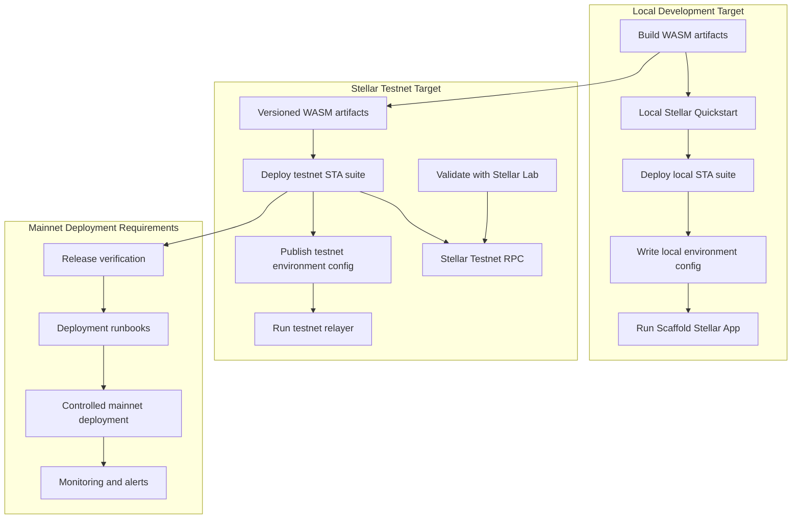

Diagram explanation:

- This topology shows how the same architecture moves through local validation, Stellar testnet validation, and mainnet deployment requirements.
- Local deployment produces local contract IDs and environment configuration; testnet deployment produces independently versioned contract IDs and public validation artifacts.
- Mainnet deployment is separate from testnet and requires release-verified artifacts, deployment runbooks, controlled deployment, and monitoring.

Key takeaway: local, testnet, and mainnet are independent deployment targets; contract IDs, environment files, and operational controls must be versioned per environment.

Deployment controls:

- Local, testnet, and mainnet each have independent contract IDs and environment files.
- Testnet contract IDs MUST be published with network passphrase and WASM hashes.
- Admin initialization MUST be reproducible from deployment scripts.
- Mainnet deployment MUST use versioned and release-verified WASM artifacts only.
- Contract addresses, policy versions, and adapter IDs MUST be versioned in the frontend environment config.

## 18. Implementation Units

Required engineering units:

1. Add Scaffold Stellar app package.
2. Generate clients for SmartAccount, PolicyEngine, IntentRegistry, adapters, and optional ConditionVerifier.
3. Implement Wallets Kit connection with Freighter and xBull priority.
4. Implement `simulateAndSign` utility around Stellar RPC.
5. Build SmartAccount setup flow.
6. Build signer and threshold management UI.
7. Build asset, adapter, and destination configuration UI.
8. Build payment execution UI.
9. Build split execution UI.
10. Build scheduled payment creation UI.
11. Build relayer execution endpoint.
12. Complete IntentRegistry lifecycle.
13. Expand PolicyEngine.
14. Add testnet deployment scripts.
15. Add event indexing and audit log view.

## 19. Architecture Control Checklist

### Stellar Integration Checklist

- Contract account model is used for treasury authority.
- `__check_auth` validates signer authority and context.
- SAC is the only v1 asset interface.
- Stellar RPC simulation is required before submission.
- Freighter and xBull are supported through Wallets Kit.
- Freighter `signAuthEntry` and `signTransaction` flows are validated end to end.
- xBull `signAuthEntry` and `signTransaction` support is tested against the active Wallets Kit module before enabling xBull-native SmartAccount signing.
- Scaffold Stellar is used for the frontend/client foundation.
- Stellar Lab can reproduce the testnet validation deployment and invocation flow.

### Security Checklist

- Relayer has no owner, management, governance, or recovery authority.
- Adapters cannot move funds independently.
- Asset allowlist defaults to deny.
- Destination allowlist defaults to deny.
- Adapter allowlist defaults to deny.
- Session keys are scoped, expiring, and capped.
- Automation capabilities pin policy version and execution window.
- Child execution IDs are unique and replay protected.
- Attestation IDs are unique and replay protected when proof-gated execution is enabled.
- Recovery freezes normal execution.
- Signer removal cannot break configured thresholds.
- Policy changes emit events and preserve automation semantics.
- Critical storage has TTL maintenance and monitoring.

## 20. Conclusion

STA is immediately buildable on Stellar because the core account architecture maps directly to Soroban contract accounts, SAC token flows, Wallets Kit signing, RPC simulation, and Lab-based testing.

The security model is intentionally conservative:

- SmartAccount is the root authority.
- Relayers are untrusted submitters.
- Assets and adapters are allowlisted.
- Automation is stored as bounded onchain capability.
- External conditions require verifier quorum when proof-gated execution is enabled.
- Recovery is separated from daily spend authority.

This makes STA suitable for treasury, payroll, vendor payment, marketplace payout, revenue distribution, DAO treasury, and tokenization platform workflows on Stellar.
