# Smart Treasury Account Technical Architecture

## 1. Purpose

This document defines the technical architecture for Smart Treasury Account (STA), a Soroban-native programmable treasury wallet for Stellar.

It is written for Stellar Community Fund review, implementation planning, and security review. It describes how STA integrates with Stellar, how the onchain contracts are composed, how wallet and relayer flows work, and which invariants must be enforced before testnet and mainnet release.

## 2. Executive Summary

STA is a policy-controlled treasury account built as a Soroban contract account. Each treasury wallet is a `SmartAccount` contract that can hold Stellar Asset Contract (SAC) balances, validate authorization through `__check_auth`, enforce treasury policy, and route approved execution through narrow adapters.

The target product supports:

- passkey-capable and wallet-first onboarding
- Freighter and xBull wallet support through Stellar Wallets Kit
- signer roles and weighted thresholds
- scoped session keys
- approved SAC assets
- approved recipients and adapters
- recurring and conditional treasury actions
- relayer-triggered execution without relayer authority
- recovery, pause, and freeze controls
- audit-friendly event and state boundaries

The first production path is a testnet PoC using:

- Rust/Soroban contracts from this repository
- Scaffold Stellar for the frontend and generated TypeScript client layer
- Stellar Wallets Kit for Freighter and xBull connection/signing
- Stellar RPC simulation and submission
- Stellar Lab for manual deployment, invocation, and XDR debugging

## 3. External Stellar References

The architecture aligns with the following Stellar documentation and tools:

- Contract accounts: https://developers.stellar.org/docs/build/guides/contract-accounts
- Stellar Asset Contract: https://developers.stellar.org/docs/tokens/stellar-asset-contract
- Scaffold Stellar: https://developers.stellar.org/docs/tools/scaffold-stellar
- Stellar Wallets Kit: https://stellarwalletskit.dev/
- Freighter wallet integration: https://developers.stellar.org/docs/build/guides/freighter
- Stellar Lab: https://developers.stellar.org/docs/tools/lab
- RPC `simulateTransaction`: https://developers.stellar.org/docs/data/apis/rpc/api-reference/methods/simulateTransaction

These references establish the core integration assumptions:

- Contract accounts can hold balances and use `__check_auth` to decide who can act and under what conditions.
- SAC is the required path for contracts to interact with Stellar assets.
- Scaffold Stellar provides the development framework for a full-stack Stellar dApp.
- Wallets Kit can connect multiple Stellar wallets, including xBull and Freighter, from one application integration.
- Freighter supports browser-based Soroban token and smart contract signing flows.
- Stellar Lab can deploy contracts, invoke smart contracts, simulate transactions, inspect XDR, and debug transaction results.
- RPC simulation is required before submission because it calculates transaction data, required authorizations, and resource fees.

## 3.1 How to Read This Architecture

This document follows a layered architecture format:

1. Product-level context: who uses STA and what systems it touches.
2. Stellar integration: contract accounts, SAC assets, wallets, RPC, and Lab.
3. Onchain architecture: SmartAccount, policy, intents, verification, recovery, and adapters.
4. Offchain architecture: frontend, wallet integration, relayer, attestors, and indexer.
5. Execution flows: immediate, scheduled, conditional, split, and recovery workflows.
6. Security architecture: trust boundaries, invariants, audit areas, and operational controls.
7. Deployment architecture: local, testnet, and mainnet readiness.

Diagrams use Mermaid so they render directly in GitHub and can be linked from the SCF submission.

## 3.2 Diagram Index

- System context: Section 5.1
- Trust boundary: Section 5.2
- Onchain contract topology: Section 6.7
- Wallet signing and simulation: Section 8.5
- Frontend module architecture: Section 9.2
- Relayer architecture: Section 10.4
- Intent state machine: Section 11.7
- Execution sequence diagrams: Section 12
- Deployment topology: Section 17.4
- Build roadmap: Section 19.7

## 4. Repository Baseline

Current workspace:

```text
contracts/
  smart_account/
  intent_registry/
  policy_engine/
  condition_verifier/
  recovery_manager/
  adapters/
    transfer_adapter/
    split_adapter/
    swap_adapter/
    yield_adapter/
shared/
  auth/
  errors/
  events/
  testutils/
  types/
```

Initial progress:

- selected SmartAccount authorization, session-key, adapter, automation, and recovery controls have been prototyped
- selected ConditionVerifier attestor quorum and replay checks have been prototyped
- the Rust/Soroban workspace and shared type system are already started
- the remaining grant work focuses on completing the target architecture, testnet PoC, wallet integration, relayer flow, and production hardening

## 4.1 Architecture Decisions for SCF Build

The following decisions remove ambiguity for the grant build plan.

### Decision 1: Wallet-first PoC, passkey-capable production architecture

STA will use a staged signer strategy:

1. The first testnet PoC will use Freighter and xBull wallet signing with Ed25519 signer records, plus scoped session keys for delegated operations.
2. The target production architecture remains passkey-capable through a P256/WebAuthn signer path in `SmartAccount`.
3. Passkey/P256 support will be implemented after a focused compatibility spike covering Stellar SDK support, wallet UX, payload normalization, and onchain verification cost.

This is the best tradeoff because it lets the project demonstrate Stellar-native treasury flows immediately with existing wallets while preserving the stronger long-term UX promised by contract accounts.

### Decision 2: IntentRegistry is a grant deliverable, not optional future work

The current SmartAccount-local automation capability storage is acceptable as an initial implementation shortcut, but the target architecture requires `IntentRegistry`.

`IntentRegistry` is part of the grant build because recurring treasury workflows need:

- parent intent lifecycle
- child execution materialization
- replay-safe execution records
- missed-window handling
- deterministic cancellation and expiry
- auditable execution history
- pruning and retention rules

SmartAccount will remain the execution authority, but IntentRegistry will become the canonical lifecycle and replay-state module for scheduled, recurring, and conditional treasury operations.

### Decision 3: Custom minimal relayer first, managed relayer optional later

STA will build a custom minimal Node.js relayer for the PoC and first testnet demo.

The relayer will:

- scan eligible execution windows
- request or receive attestation proofs
- build Soroban invocation transactions
- call RPC simulation
- submit transactions
- poll transaction status
- index execution results

OpenZeppelin Relayer or another managed relayer may be evaluated later, but it should not be a dependency for the first grant deliverable. A custom relayer gives the team full visibility into Soroban simulation, auth handling, transaction assembly, retries, and replay failure modes during the most important security-hardening phase.

Current tests cover:

- SmartAccount initialization
- `__check_auth` signer validation
- role separation
- management, governance, recovery, and spend thresholds
- session key scope enforcement
- account allowlists
- adapter execution and rejection paths
- stored automation execution
- attestation-gated execution
- replay protection
- pause, freeze, and recovery finalization
- ConditionVerifier governance and quorum validation

## 5. System Context

### 5.1 System Context Diagram

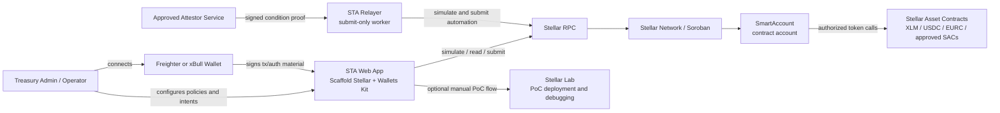

### 5.2 Trust Boundary Diagram

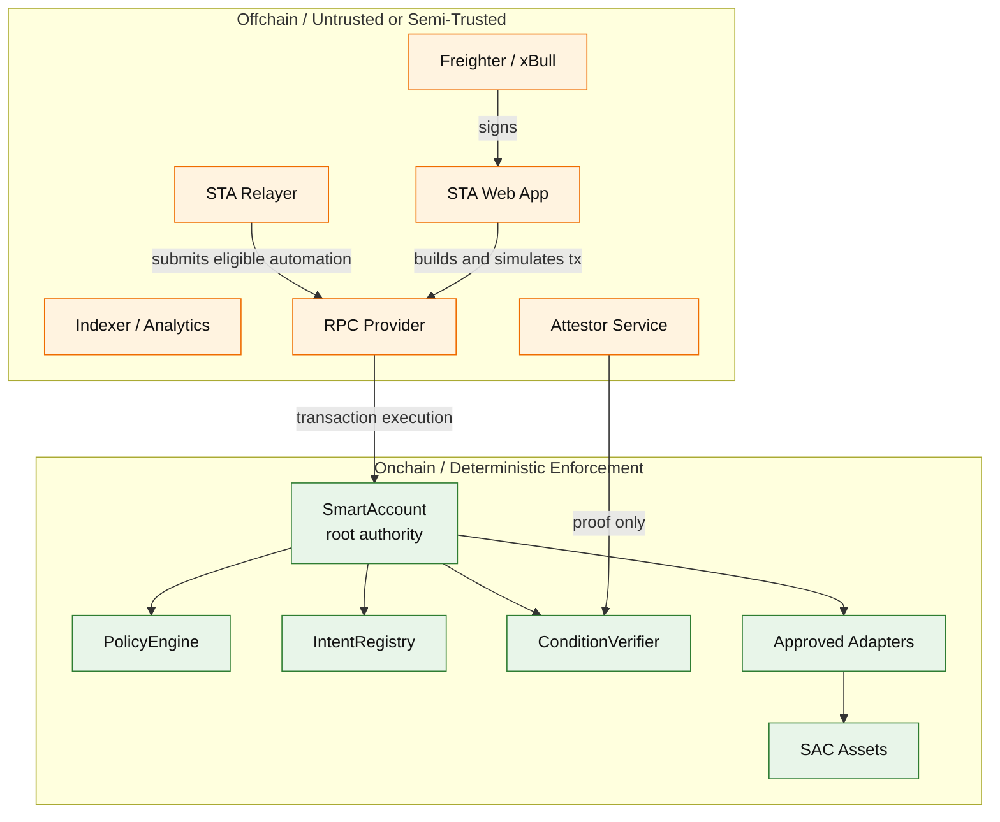

Security interpretation:

- Offchain systems can prepare, sign, submit, index, and display actions.
- Only onchain contracts decide whether treasury movement is valid.
- The relayer is intentionally outside the trust boundary and cannot create authority.

## 6. Onchain Contract Architecture

### 6.1 SmartAccount

`SmartAccount` is the root authority for each treasury wallet.

Responsibilities:

- hold SAC balances
- implement Soroban custom account authorization through `__check_auth`
- store signer records
- store session key scopes
- store account policy pointers
- store allowed asset configuration
- store allowed destination configuration
- store approved adapter configuration
- validate interactive execution
- validate stored automation
- consume child execution IDs
- dispatch to adapters
- coordinate recovery, pause, and freeze controls

The SmartAccount is intentionally not a generic executor. It only routes to approved adapters with known action payloads.

Representative target entrypoints:

```text
initialize(bootstrap_admin, policy_engine, intent_registry, condition_verifier, recovery_manager)
add_signer(record)
remove_signer(signer_id)
create_session_key(record, scope)
revoke_session_key(signer_id)
set_asset_config(asset, config)
set_adapter_config(adapter_id, config)
set_destination_allowed(destination, allowed)
grant_automation_capability(capability)
revoke_automation_capability(capability_id)
execute_interactive(action, expected_policy_version, signer_id)
execute_automation(capability_id, child_execution_id, attestation_proof)
pause()
unpause()
freeze()
initiate_recovery(...)
cancel_recovery()
finalize_recovery()
```

### 6.2 PolicyEngine

`PolicyEngine` validates account-level rules that are easier to evolve independently from SmartAccount.

Current scope:

- current policy version
- allow or block payments
- allow or block adapter actions
- maximum asset risk tier

Target scope:

- per-asset limits
- per-destination limits
- daily and rolling outflow windows
- operation-specific thresholds
- high-risk action escalation
- policy version migration rules
- policy version pinning for stored automation

### 6.3 IntentRegistry

`IntentRegistry` is the canonical intent state machine.

Target storage:

- `parent_intent::<intent_id> -> ParentIntent`
- `child_execution::<child_execution_id> -> ChildExecution`
- `attestation_consumed::<attestation_id> -> bool`
- `intent_usage::<intent_id> -> UsageState`
- `intent_nonce::<account> -> u64`

Target responsibilities:

- create parent intents
- activate, cancel, expire, and terminally fail intents
- materialize child execution IDs
- consume child execution records atomically
- prevent replay
- maintain cumulative usage
- prune mature replay records only after deterministic retention rules

### 6.4 ConditionVerifier

`ConditionVerifier` verifies offchain condition proofs for conditional execution.

Responsibilities:

- store approved attestors
- store attestor threshold
- enforce delayed governance changes
- verify Ed25519 attestor signatures
- bind proofs to SmartAccount, verifier contract, attestation ID, capability ID, and expiry ledger
- reject duplicate attestors
- reject insufficient quorum
- mark attestation IDs consumed

### 6.5 RecoveryManager

`RecoveryManager` is reserved for future separation of emergency workflow orchestration.

Current recovery controls live in `SmartAccount`:

- pause
- freeze
- delayed recovery plan
- guardian signer support
- signer replacement on recovery finalization
- recovery-mode policy engine replacement
- recovery-mode asset, adapter, destination, and capability lock-down

### 6.6 Execution Adapters

Adapters are deliberately narrow. They do not create authority and must require SmartAccount authorization.

Adapter set:

- `TransferAdapter`: SAC transfer from SmartAccount to destination.
- `SplitAdapter`: one SAC balance split across approved recipients.
- `SwapAdapter`: approved treasury route execution with slippage constraints.
- `YieldAdapter`: approved treasury strategy operation.

Adapter security rule:

```text
No adapter may move treasury assets unless SmartAccount has preauthorized the exact operation.
```

### 6.7 Onchain Contract Topology

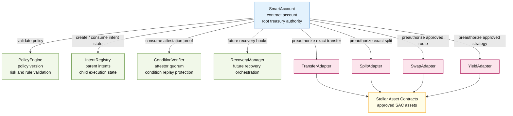

Contract topology rules:

- SmartAccount stores or resolves the canonical addresses for subordinate contracts.
- Subordinate contracts must never be able to move funds independently.
- Adapters must only execute after SmartAccount authorization.
- SAC contracts are the only supported asset interface in v1.

### 6.8 Contract Governance and Replacement Rules

Contract/module replacement is a high-risk governance action.

Default v1 rule:

- SmartAccount, PolicyEngine, IntentRegistry, ConditionVerifier, and adapter addresses are pinned at SmartAccount initialization unless a delayed governance path is explicitly enabled.

If replacement is enabled, it must satisfy all of the following:

- replacement requires governance-role threshold authorization
- replacement is delayed by a configured governance delay
- replacement emits a scheduled event and an applied event
- replacement increments SmartAccount `policy_version` where execution semantics can change
- existing automation capabilities remain pinned to the policy version and adapter IDs they were created under
- pending child executions cannot silently migrate to a new policy or adapter implementation
- emergency recovery replacement can only occur while the account is frozen or recovery-pending
- UI and relayer must refuse to execute stale cached contract addresses after replacement events

Replacement classes:

| Component | Default | Replacement Rule |
|---|---|---|
| SmartAccount | immutable per treasury account | migrate by deploying a new account and moving assets through explicit owner action |
| PolicyEngine | pinned | delayed governance or recovery-mode replacement with policy version bump |
| IntentRegistry | pinned | delayed governance; migration plan must preserve parent and child replay state |
| ConditionVerifier | pinned | delayed governance; attestor set version must change |
| Adapters | pinned by adapter ID | delayed governance; existing capabilities remain bound to original adapter ID |
| SAC assets | allowlisted by address | management/governance configuration; no implicit asset substitution |

## 7. Stellar Asset Contract Integration

V1 is SAC-only.

This is a deliberate scope decision:

- contracts interact with Stellar assets through SAC
- each supported asset must have an asset contract address
- every asset must be explicitly configured in SmartAccount
- every adapter must explicitly allow the asset
- unsupported assets fail closed

SAC handling:

- User or issuer deploys the SAC for the asset if not already deployed.
- Admin configures the asset in SmartAccount with `AssetConfig`.
- Admin configures adapters with `allowed_assets`.
- Payment and adapter actions reference the SAC contract address.
- SmartAccount calls `authorize_as_current_contract` for exact token transfer sub-invocations.
- Adapter invokes the SAC token client transfer.

Important asset constraints:

- Asset issuers may require authorization.
- Contract balances for issued assets live in contract data.
- Account balances for issued assets live in trust lines.
- Transfers from a contract account to classic accounts use SAC semantics, not classic payment operations.
- V1 does not support arbitrary classic path payments or SDEX orderbook operations from the contract.

## 8. Wallet Integration Architecture

### 8.1 Supported Wallets

Initial wallet focus:

- Freighter
- xBull

Integration library:

- Stellar Wallets Kit

The frontend will initialize Wallets Kit with default wallet modules and prioritize Freighter and xBull in the connection UI. WalletConnect and additional supported wallets can remain available after the primary flows are stable.

### 8.2 Wallet Responsibilities

Wallets are responsible for:

- connecting a user account
- returning the active Stellar address
- signing transaction XDRs
- signing Soroban authorization entries when required by the flow
- presenting user-readable transaction prompts when possible

Wallets are not responsible for:

- evaluating treasury policy
- storing automation authority
- acting as relayers
- bypassing SmartAccount authorization

### 8.3 Custom Account Signature Model

STA uses Soroban contract-account authorization. The critical implementation detail is that the wallet or app must produce authorization material that matches the SmartAccount `__check_auth` signature type.

The target signer model supports three practical signing paths:

1. Wallet Ed25519 signer path
   - Freighter or xBull signs the Soroban transaction or required authorization entry.
   - The SmartAccount signer record stores the wallet public key as an Ed25519 signer.
   - This is the fastest PoC path because it aligns with existing wallet behavior.

2. Passkey/P256 signer path
   - The app creates or registers a passkey credential.
   - The SmartAccount stores a signer record bound to the P256/WebAuthn public key and credential metadata hash.
   - `__check_auth` verifies the P256/WebAuthn assertion or a normalized signed payload.
   - This is the target production signer path after the PoC proves the wallet Ed25519 and session-key flows.

3. Scoped session key path
   - A primary signer authorizes creation of a temporary Ed25519 session key.
   - The app or relayer uses that session key only inside the stored scope.
   - The session key cannot manage signers, modify policy, or exceed its asset, destination, adapter, expiry, or amount caps.

For all paths, the signed payload must bind:

- network passphrase
- SmartAccount contract address
- function name
- action payload
- signer ID
- policy version
- nonce or execution identifier where applicable
- expiry ledger where applicable

This prevents replay across networks, accounts, policies, and execution contexts.

#### 8.3.1 PoC Signature Envelope

The first PoC signer path uses wallet Ed25519 signing. The SmartAccount signature envelope is explicit and versioned:

```text
StaAuthEnvelopeV1 {
  domain: "STA_AUTH_V1",
  network_passphrase: string,
  smart_account: Address,
  contract_fn: Symbol,
  action_hash: BytesN<32>,
  signer_id: BytesN<32>,
  policy_version: u32,
  nonce_or_execution_id: BytesN<32>,
  expires_ledger: u32
}
```

Signing flow:

1. The app builds the Soroban invocation and derives `action_hash` from the canonical XDR/Soroban value representation of the action payload.
2. The app simulates the transaction with RPC `authMode = record` to collect required authorization data and resource information.
3. The app asks Freighter or xBull to sign the transaction XDR or the required authorization entry when supported by the wallet.
4. For session-key and non-wallet signer flows, the app signs `StaAuthEnvelopeV1` directly with the relevant Ed25519 key.
5. The submitted SmartAccount signature payload must match the signer record stored onchain.

Wallet compatibility rule:

- The PoC must support the simplest wallet path that works reliably with Freighter and xBull: user wallet signs the Soroban transaction/auth material, while SmartAccount signer records bind the wallet public key.
- If a wallet cannot expose the required auth-entry signing path for a specific SmartAccount flow, the PoC falls back to wallet-authorized creation of a scoped session key and uses that session key for bounded execution.
- No fallback may grant broader authority than the user-approved session scope.

### 8.4 Frontend Signing Flow

Interactive execution flow:

```text
1. User connects Freighter or xBull through Wallets Kit.
2. App fetches SmartAccount status and policy state from RPC.
3. User creates a payment, split, swap, or yield action.
4. App builds the `execute_interactive` invocation.
5. App simulates the transaction with RPC.
6. Simulation returns required auth entries, resource fee, and transaction data.
7. App asks the wallet to sign the transaction, required authorization entry, or `StaAuthEnvelopeV1` depending on signer path.
8. Signed XDR is submitted by the wallet, app backend, or relayer.
9. SmartAccount validates `__check_auth`, policy, adapter constraints, and dispatches.
10. UI shows event-derived execution status.
```

Automation creation flow:

```text
1. User connects wallet.
2. User defines an automation envelope.
3. App shows policy summary: assets, recipients, amount caps, execution window, max executions.
4. User signs creation of the bounded capability.
5. SmartAccount stores `AutomationCapabilityState`.
6. Future relayers can trigger only within the stored capability envelope.
```

Automation execution flow:

```text
1. Relayer detects eligible child execution window.
2. Relayer builds `execute_automation`.
3. Relayer includes required attestation proof when needed.
4. Transaction is simulated.
5. Relayer submits transaction.
6. SmartAccount validates capability, policy version, execution window, child ID, attestation, and policy.
7. SmartAccount dispatches the adapter call.
8. Child execution ID is marked consumed.
```

### 8.5 Wallet Signing and Simulation Diagram

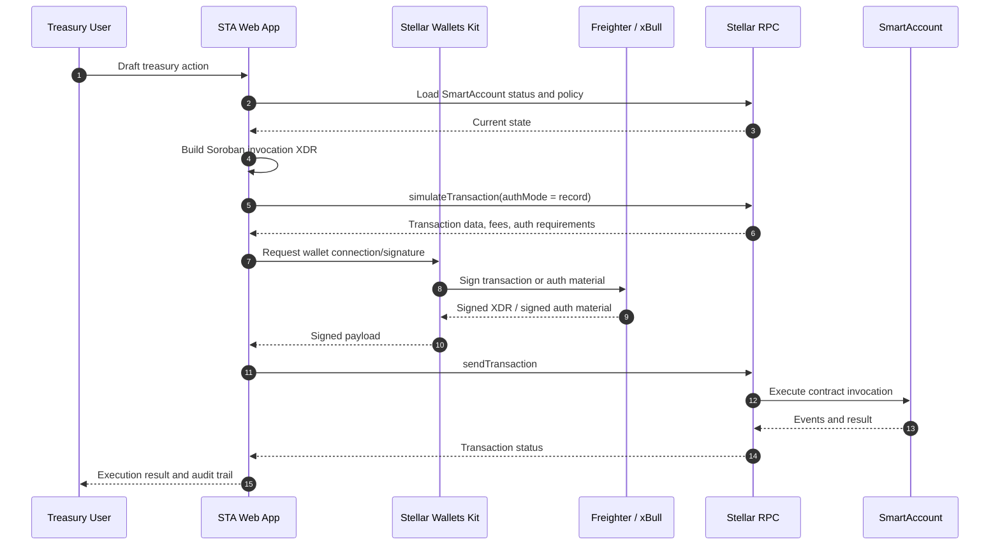

Signing rule:

- The app must simulate before signing.
- The signed payload must bind the network, SmartAccount address, action payload, signer ID, policy version, and expiry or execution identifier.
- The wallet UX should show a human-readable summary of the action before requesting signature.

## 9. Frontend and PoC Framework

### 9.1 Scaffold Stellar

The PoC frontend will use Scaffold Stellar as the starting framework.

Reference: https://developers.stellar.org/docs/tools/scaffold-stellar

Rationale:

- Rust contract workspace compatibility
- modern frontend structure
- generated TypeScript clients
- environment configuration for local, testnet, and future mainnet
- faster path from deployed contracts to usable UI

Scaffold setup path:

```text
cargo install --locked stellar-scaffold-cli
cargo install --locked stellar-registry-cli
stellar scaffold init sta-app
cd sta-app
npm start
```

STA will use Scaffold Stellar for the application shell and contract-client workflow, while preserving this repository as the canonical contract workspace. The frontend package can either live under `app/` in this repository or be initialized as a sibling package and then migrated into a workspace once the contract interfaces stabilize.

Target application structure:

```text
app/
  src/
    components/
      AccountSelector.tsx
      TreasuryDashboard.tsx
      PolicyEditor.tsx
      SignerManager.tsx
      SessionKeyManager.tsx
      IntentBuilder.tsx
      ExecutionQueue.tsx
      RecoveryPanel.tsx
    contracts/
      smartAccountClient.ts
      policyEngineClient.ts
      intentRegistryClient.ts
      conditionVerifierClient.ts
      adapterClients.ts
    stellar/
      walletKit.ts
      rpc.ts
      transactionBuilder.ts
      simulation.ts
      xdr.ts
    routes/
      dashboard.tsx
      account-create.tsx
      policies.tsx
      intents.tsx
      recovery.tsx
  environments.toml
```

Environment configuration:

```text
local:
  network_passphrase: local sandbox network
  rpc_url: local quickstart RPC
  contracts: locally deployed SmartAccount suite

testnet:
  network_passphrase: Test SDF Network ; September 2015
  rpc_url: Stellar testnet RPC provider
  contracts: published testnet contract IDs

mainnet:
  network_passphrase: Public Global Stellar Network ; September 2015
  rpc_url: production RPC provider
  contracts: audited and published contract IDs
```

Generated client responsibilities:

- encode Soroban contract arguments for SmartAccount and subordinate contracts
- build invocation transactions for setup and execution flows
- fetch read-only status snapshots
- call simulation before wallet signing
- decode result XDR and error codes for UI display

Frontend integration milestones:

1. Initialize Scaffold Stellar app.
2. Add Wallets Kit connection and network state.
3. Generate or hand-wrap TypeScript clients for current contracts.
4. Add SmartAccount setup screens.
5. Add transaction simulation and signing utility.
6. Add execution dashboards for payment, split, automation, and recovery flows.

### 9.2 Frontend Module Architecture

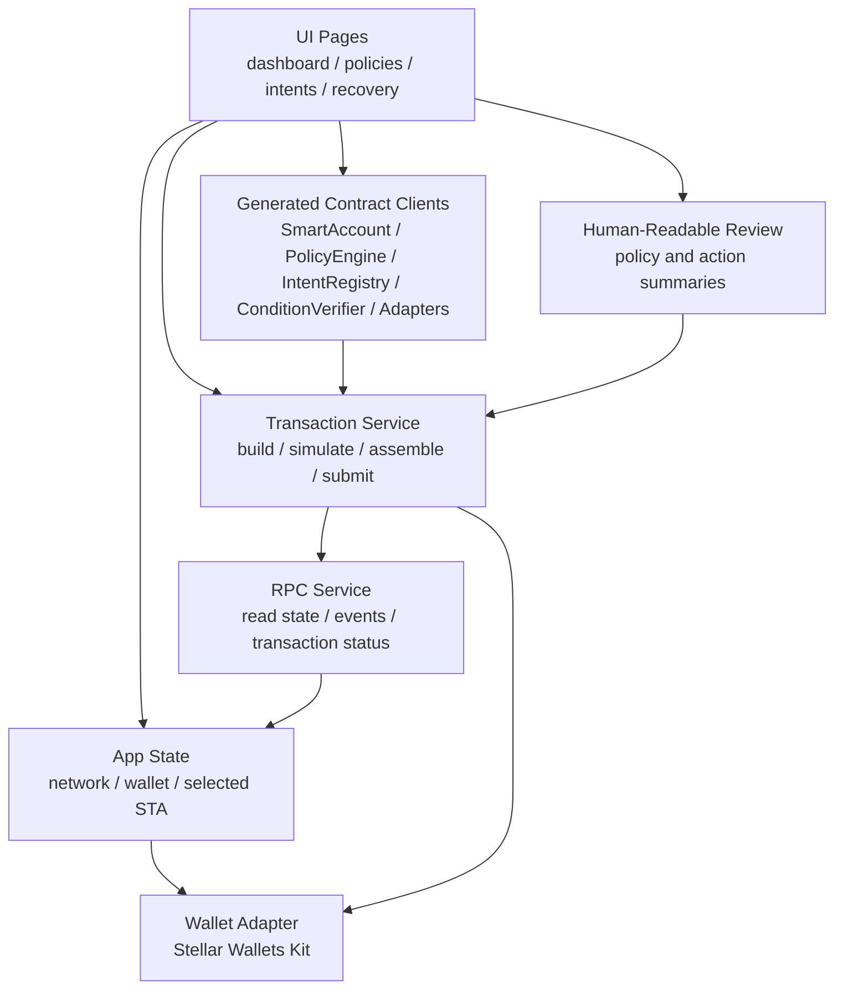

Frontend safety requirements:

- Always show asset, amount, destination, adapter, expiry, policy version, and signer before signing.
- Never ask the wallet to sign opaque XDR without a decoded summary.
- Treat RPC responses as untrusted until confirmed by transaction result and events.
- Cache only read models; never cache authority.
- Keep network passphrase visible in developer/testnet builds to prevent wrong-network signing.

### 9.3 Stellar Lab PoC

Stellar Lab will be used for early PoC validation and grant demos.

Lab usage:

- create and fund testnet accounts
- deploy contract WASM files
- deploy SAC instances for test assets if needed
- invoke SmartAccount setup functions
- simulate `execute_interactive`
- inspect XDR
- inspect failed transaction metadata
- share saved API requests and transaction examples

The Lab flow is useful for reviewers because it provides a reproducible, browser-based way to inspect the contract behavior before a complete frontend is finished.

## 10. Offchain Services

### 10.1 Relayer

The relayer is a submitter, not an authority.

Responsibilities:

- monitor eligible scheduled or conditional execution windows
- request or receive attestation proofs
- build `execute_automation` transactions
- simulate transactions
- pay transaction fees
- submit automation trigger transactions for already-authorized capabilities
- report execution status to UI

The relayer cannot:

- create signers
- create automation capabilities
- expand execution scope
- change policy
- bypass replay protection
- move funds outside SmartAccount policy

Relayer implementation path:

- first PoC: custom Node.js service using Stellar SDK and RPC
- grant hardening: hosted worker with queue, retry logic, execution locks, and monitoring
- later evaluation: OpenZeppelin Relayer or another managed relayer, only if it preserves the same no-authority trust boundary

### 10.2 Attestor Service

The attestor service signs external condition proofs.

Examples:

- invoice approved
- shipment delivered
- milestone accepted
- compliance approval received
- marketplace payout window closed

Attestor proof requirements:

- domain string: `STA_CONDITION_ATTESTATION_V1`
- network passphrase
- smart account address
- verifier contract address
- attestor set version
- attestation ID
- capability ID
- condition payload hash
- expiry ledger
- attestor Ed25519 signature

Only approved attestors count toward quorum.

The signed attestation payload is:

```text
StaConditionAttestationV1 {
  domain: "STA_CONDITION_ATTESTATION_V1",
  network_passphrase: string,
  smart_account: Address,
  condition_verifier: Address,
  attestor_set_version: u32,
  attestation_id: BytesN<32>,
  capability_id: BytesN<32>,
  condition_payload_hash: BytesN<32>,
  expires_ledger: u32
}
```

Attestation rules:

- `condition_payload_hash` must commit to the business fact being attested, such as invoice ID, milestone ID, payer/payee, amount, asset, and approval metadata hash.
- `attestor_set_version` prevents proofs from an old attestor set from being replayed after governance changes.
- `network_passphrase` prevents cross-network replay.
- The verifier contract address prevents reuse across verifier deployments.
- The attestation ID must be consumed once and only once.

### 10.3 Indexer and Event Consumer

The PoC can start by reading RPC events directly. A production service should index:

- account initialization
- signer changes
- policy changes
- session creation and revocation
- intent creation and cancellation
- automation execution
- attestation consumption
- recovery actions
- adapter execution records

This powers:

- dashboard history
- audit exports
- monitoring alerts
- execution reconciliation

### 10.4 Relayer Architecture

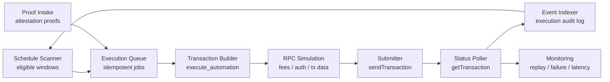

Relayer safety requirements:

- Every job must be idempotent by `child_execution_id`.
- The relayer must simulate before submit.
- The relayer must not hold owner, management, governance, or recovery keys.
- The relayer may only submit `execute_automation` for already-authorized capabilities.
- Retry logic must distinguish temporary RPC failures from terminal policy failures.
- Duplicate submissions must fail safely through onchain replay checks.

## 11. Core State Model

### 11.1 SignerRecord

```text
signer_id: BytesN<32>
signer_kind: Ed25519 | PasskeyP256 | PolicySigner | SessionKey | Guardian
role_bitmap: u32
status: Active | Revoked | Expired
weight: u32
created_ledger: u32
expires_ledger: Option<u32>
metadata_hash: BytesN<32>
```

Roles:

- payment spend
- adapter spend
- management
- governance
- recovery
- session default

### 11.2 SessionScope

```text
allowed_action_bitmap: u32
allowed_assets: Vec<Address>
allowed_destinations: Vec<Address>
allowed_adapters: Vec<BytesN<32>>
per_execution_cap: i128
cumulative_cap: i128
consumed_amount: i128
expiry_ledger: u32
single_use: bool
```

Session keys must be bounded, expiring, and non-escalating.

### 11.3 AssetConfig

```text
enabled: bool
risk_tier: u32
max_single_transfer: i128
```

### 11.4 AdapterConfig

```text
adapter_address: Address
enabled: bool
adapter_type: payment | swap | yield | split
max_single_execution_amount: i128
allowed_assets: Vec<Address>
max_slippage_bps: u32
allowed_yield_operations: u32
max_split_recipients: u32
max_exposure_bps: u32
```

### 11.5 AutomationCapability

```text
capability_id: BytesN<32>
parent_intent_id: BytesN<32>
action: InteractiveAction
required_attestation_id: Option<BytesN<32>>
policy_version: u32
executable_from_ledger: u32
executable_until_ledger: u32
max_executions: u32
```

### 11.6 ChildExecution

Target fields:

```text
child_execution_id: BytesN<32>
parent_intent_id: BytesN<32>
capability_id: BytesN<32>
status: Pending | ConsumedInProgress | Executed | Skipped | Cancelled | FailedTerminal
execution_window_start: u32
execution_window_end: u32
attempt_count: u32
settled_ledger: Option<u32>
```

### 11.7 Intent State Machine

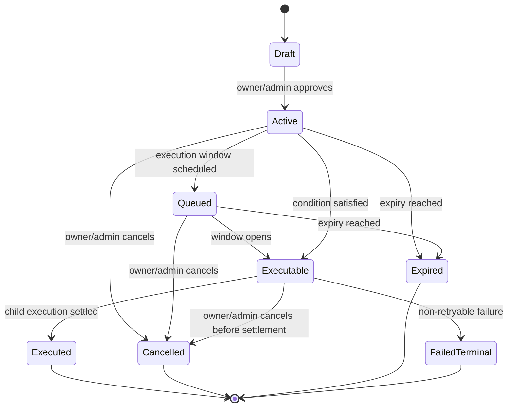

Intent rules:

- Terminal states are `Executed`, `Cancelled`, `Expired`, and `FailedTerminal`.
- A recurring parent intent may produce many child executions, but each child execution can settle only once.
- Missed windows default to skip unless the parent intent explicitly allows safe catch-up behavior.
- Cumulative caps are tracked at the parent intent level and must survive pruning of mature child records.

## 12. Key Workflows

### 12.1 Create a Smart Treasury Account

```text
1. Deploy SmartAccount.
2. Deploy PolicyEngine.
3. Deploy IntentRegistry.
4. Deploy ConditionVerifier.
5. Deploy adapters.
6. Initialize SmartAccount with subordinate contract addresses.
7. Add primary signer.
8. Configure management/governance/recovery thresholds.
9. Configure approved SAC assets.
10. Configure approved adapters.
11. Configure destination allowlist.
12. Transfer treasury assets into SmartAccount SAC balance.
```

### 12.2 Immediate Vendor Payment

```text
1. Operator selects approved SAC asset and destination.
2. App builds PaymentAction.
3. App simulates `execute_interactive`.
4. Wallet signs.
5. SmartAccount validates signer role and policy version.
6. SmartAccount checks asset enabled, amount cap, destination allowlist, adapter config.
7. SmartAccount preauthorizes exact SAC transfer.
8. TransferAdapter invokes SAC transfer.
9. Event emitted and UI updates.
```

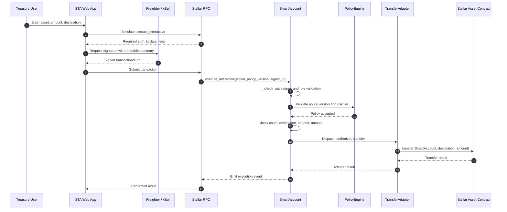

### 12.3 Scoped Session Key

```text
1. Admin creates session key record.
2. Admin defines session scope.
3. SmartAccount validates bounded scope.
4. Session key can execute only matching interactive actions.
5. Consumed amount is updated after execution.
6. Session is revoked automatically if single-use or cumulative cap is reached.
```

### 12.4 Scheduled Payment

```text
1. Admin creates parent intent.
2. SmartAccount authorizes creation of a bounded capability.
3. IntentRegistry stores the parent intent and future child windows.
4. Relayer detects eligible window.
5. Relayer submits `execute_automation`.
6. SmartAccount validates child execution ID is unused.
7. SmartAccount validates capability window and policy version.
8. SmartAccount dispatches transfer.
9. IntentRegistry records child execution settlement and replay status.
```

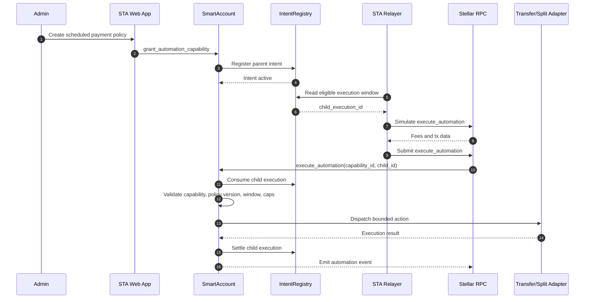

### 12.5 Conditional Payment

```text
1. Admin creates capability requiring attestation ID.
2. External condition occurs.
3. Approved attestor signs proof.
4. Relayer submits proof with `execute_automation`.
5. ConditionVerifier verifies freshness, quorum, uniqueness, and binding.
6. SmartAccount executes approved action.
7. Attestation and child execution are consumed.
```

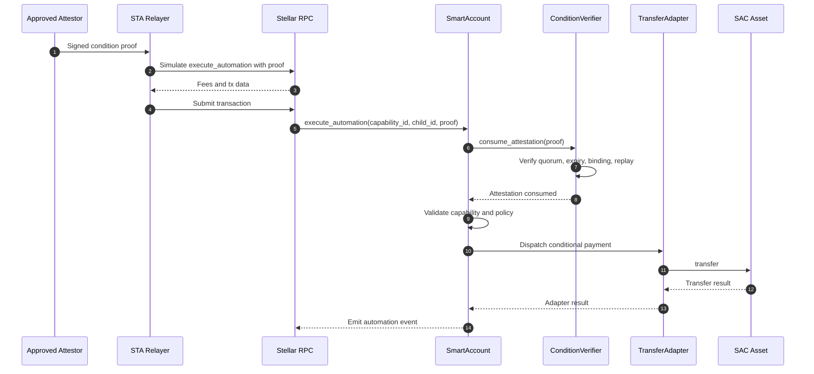

### 12.6 Revenue Split

```text
1. Admin configures recipients and caps.
2. App builds SplitAction with exact recipient amounts.
3. SmartAccount validates asset, adapter, recipients, duplicate destinations, and total amount.
4. SplitAdapter transfers exact SAC amounts to recipients.
5. Execution result is indexed for audit.
```

### 12.7 Recovery

```text
1. Guardian or recovery quorum triggers freeze.
2. Frozen account blocks normal execution.
3. Recovery plan is initiated with new signers and thresholds.
4. Recovery delay must elapse.
5. Recovery quorum finalizes plan.
6. Old signers and sessions are cleared.
7. New signers are installed.
8. Policy version increments.
9. Account unfreezes.
```

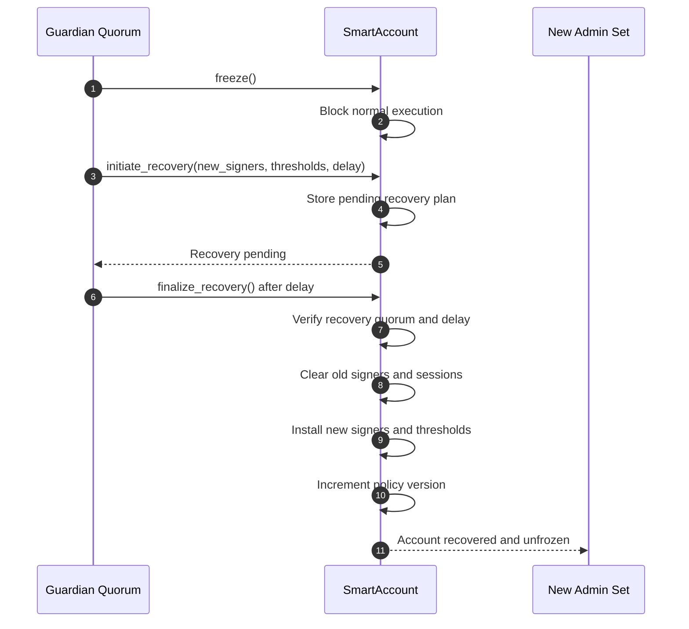

## 13. Security Architecture

### 13.1 Trust Boundaries

Trusted onchain root:

- SmartAccount contract code

Constrained onchain modules:

- PolicyEngine
- IntentRegistry
- ConditionVerifier
- approved adapters
- approved SAC assets

Untrusted or semi-trusted offchain components:

- frontend
- relayer
- RPC provider
- indexer
- attestor service until quorum verified onchain
- wallet UI display layer

Critical rule:

```text
Offchain components may prepare, submit, display, and monitor actions, but only onchain policy can authorize treasury movement.
```

### 13.2 Security Invariants

The following invariants must hold at all times:

- SmartAccount is the only contract that can authorize treasury value movement.
- Adapters cannot move funds without SmartAccount authorization.
- A session key cannot execute outside its stored scope.
- A relayer cannot create or expand authority.
- A stored automation cannot execute outside its capability envelope.
- A child execution ID cannot be consumed twice.
- A required attestation cannot be reused.
- A frozen account cannot execute normal treasury actions.
- Recovery cannot reduce signer safety below configured thresholds.
- Policy version changes cannot silently mutate existing automation semantics.
- Unsupported assets fail closed.
- Disabled adapters fail closed.
- Destinations default to disallowed.

### 13.3 Auditor Review Areas

High-priority audit areas:

- `__check_auth` context parsing and signer binding
- signature ordering and duplicate signature rejection
- signer weight accounting
- threshold updates and signer removal edge cases
- session key scope validation
- session consumed amount accounting
- adapter preauthorization correctness
- policy version pinning
- automation replay protection
- attestation proof binding
- recovery transition rules
- frozen and paused state bypass checks
- storage TTL and archival handling
- integer overflow and `i128` amount validation
- adapter allowlist and asset allowlist correctness

### 13.4 Known Design Risks and Mitigations

| Risk | Mitigation |
|---|---|
| Relayer submits malicious action | Onchain policy validates exact action and relayer has no authority |
| Session key abuse | Session scopes bind action type, assets, destinations, adapters, caps, and expiry |
| Replay of scheduled execution | Child execution IDs are stored as consumed |
| Replay of external condition | ConditionVerifier stores consumed attestation IDs |
| Policy migration changes old automations | Automation capabilities pin policy version |
| Adapter escape hatch | SmartAccount validates adapter type, enabled status, asset allowlist, and limits before dispatch |
| Frozen account bypass | Execution entrypoints call active-state checks |
| Governance compromise | Role separation, weighted thresholds, delayed governance for verifier changes |
| Asset issuer restrictions | SAC authorization and trustline behavior are treated as deployment prerequisites |
| State archival | TTL extension and monitoring are required for production readiness |

## 14. RPC, Simulation, and Transaction Submission

All smart contract execution should be simulated before submission.

Simulation responsibilities:

- calculate required transaction data
- calculate minimum resource fee
- identify required authorization entries
- detect policy and auth failures before wallet prompt
- prepare final XDR for signing

Recommended client flow:

```text
build transaction
simulateTransaction(authMode = record when collecting auth)
assemble transaction with returned data and fees
request wallet signature
simulateTransaction(authMode = enforce after signatures/auth are assembled)
submit transaction with sendTransaction
poll getTransaction
index emitted events
```

Simulation must be part of:

- immediate payments
- adapter actions
- signer management
- policy updates
- automation creation
- automation execution
- recovery actions

Simulation mode rule:

- Use `record` mode only to discover authorization requirements and prepare signing material.
- Use `enforce` mode after signatures or authorization entries are assembled to catch auth and policy failures before final submission where wallet/tooling support permits.
- If a wallet cannot support an enforce-mode pre-submit round trip, the UI must clearly mark the transaction as “simulated for auth collection; final validation occurs on submission” and show the exact onchain failure if submission is rejected.

## 15. Events and Observability

Events should be emitted for every security-significant action:

- account initialized
- signer added or removed
- threshold changed
- session key created or revoked
- asset configured
- adapter configured
- destination allowlist changed
- intent created or cancelled
- automation capability granted or revoked
- interactive execution succeeded
- automation execution succeeded
- attestation consumed
- account paused, unpaused, or frozen
- recovery initiated, cancelled, or finalized
- policy version changed

Operational monitoring should alert on:

- failed auth attempts
- repeated replay attempts
- frozen or paused state
- high-value execution
- policy version changes
- verifier threshold changes
- signer set changes
- TTL nearing archival threshold

## 16. Storage and TTL Strategy

Persistent storage is required for:

- initialization state
- signer records
- session scopes
- threshold totals
- asset configs
- adapter configs
- destination allowlists
- automation capabilities
- child execution consumption
- pending recovery plans
- policy version
- attestor approvals
- consumed attestation IDs

Production requirements:

- extend TTL on successful state-changing calls touching critical entries
- provide explicit maintenance methods for TTL extension
- monitor low TTL for signer state, recovery state, active intents, and replay records
- define pruning rules for mature child execution and attestation records
- never prune records before deterministic replay-safety windows expire

### 16.1 TTL Maintenance Methods

Target maintenance entrypoints:

```text
extend_account_ttl(targets)
extend_intent_ttl(parent_intent_id, child_range)
extend_attestation_ttl(attestation_ids)
extend_policy_ttl()
prune_replay_state(parent_intent_id, mature_range)
```

Permission model:

- Owner, management quorum, or governance quorum can extend all critical TTL targets.
- Permissionless TTL extension is allowed for non-mutating maintenance of clearly identified public targets, such as active intent records or consumed replay records, because extending TTL does not grant authority or alter execution semantics.
- Pruning replay state is permissionless only after deterministic maturity conditions are satisfied.
- Pruning must never reduce parent intent cumulative counters or make a child execution replayable.

Critical TTL targets:

| State | TTL Handling |
|---|---|
| signer records | extend on auth, signer management, and maintenance |
| session scopes | extend on session use and maintenance until expiry |
| threshold totals | extend on auth and management changes |
| asset configs | extend on execution and asset config changes |
| adapter configs | extend on execution and adapter config changes |
| destination allowlists | extend on execution and allowlist changes |
| automation capabilities | extend on creation, execution, and maintenance |
| parent intents | extend on lifecycle change, execution, and maintenance |
| child execution replay records | retain until replay-retention window expires |
| consumed attestation IDs | retain until attestation expiry plus retention buffer |
| pending recovery plans | extend on recovery actions and maintenance |

Operational thresholds:

- Alert when any critical state falls below `LOW_TTL_WARNING_LEDGERS`.
- Attempt automatic maintenance before `LOW_TTL_CRITICAL_LEDGERS`.
- Treat expired signer, recovery, or replay-protection state as an incident, not a normal user error.

Retention constants:

```text
RETENTION_BUFFER_LEDGERS
LOW_TTL_WARNING_LEDGERS
LOW_TTL_CRITICAL_LEDGERS
MAX_PRUNE_BATCH_SIZE
```

These constants must be fixed per deployment version and documented with the deployed contract IDs.

## 17. Deployment Architecture

### 17.1 Local Development

Tools:

- Rust and Cargo
- Stellar CLI
- Docker Quickstart
- Scaffold Stellar frontend
- Wallets Kit

Local flow:

```text
cargo test --workspace
stellar contract build
stellar quickstart local network
deploy contracts
configure environment
run frontend
execute test flows
```

### 17.2 Testnet Deployment

Testnet flow:

```text
1. Build all contract WASM artifacts.
2. Upload and deploy SmartAccount.
3. Upload and deploy PolicyEngine.
4. Upload and deploy IntentRegistry.
5. Upload and deploy ConditionVerifier.
6. Upload and deploy adapters.
7. Deploy or resolve SAC contracts for test assets.
8. Initialize contracts.
9. Configure signer set, policies, adapters, and allowlists.
10. Fund SmartAccount.
11. Execute payment, split, automation, and conditional demos.
12. Publish contract IDs and reproducible demo instructions.
```

### 17.3 Mainnet Readiness

Before mainnet:

- complete IntentRegistry implementation
- expand PolicyEngine rules
- harden adapters for real venues and strategies
- complete TTL maintenance
- complete deployment scripts
- complete event indexing
- complete frontend policy review screens
- complete relayer monitoring
- complete independent audit
- run testnet rehearsal with production-like configs

### 17.4 Deployment Topology

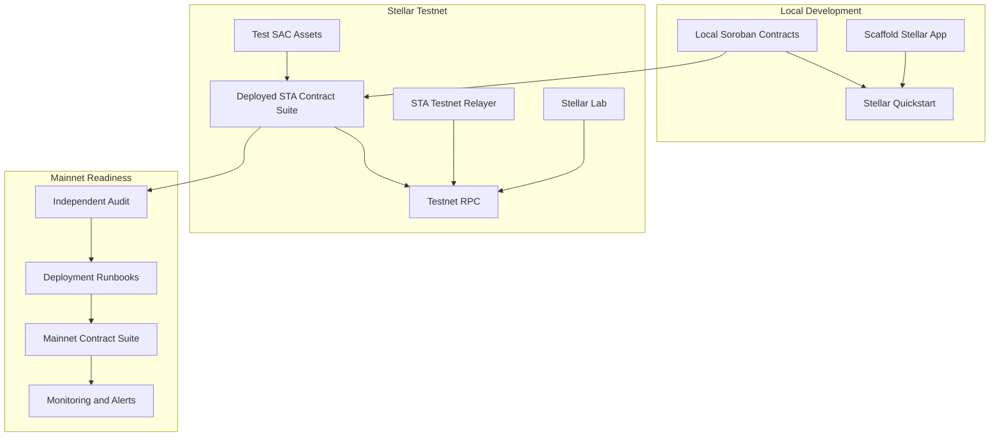

Deployment controls:

- Testnet contract IDs must be published with network passphrase and WASM hashes.
- Admin initialization must be reproducible from deployment scripts.
- Mainnet deployment must use audited WASM artifacts only.
- Contract addresses, policy versions, and adapter IDs must be versioned in the frontend environment config.

## 18. PoC Acceptance Criteria

The PoC is complete when reviewers can verify:

- a SmartAccount can be deployed and initialized on Stellar testnet
- Freighter and xBull can connect through Wallets Kit
- a signer can create or approve a treasury action
- the app simulates before signing
- a SAC asset can be configured and transferred from SmartAccount
- an approved destination payment succeeds
- an unapproved destination payment fails
- a scoped session key can execute only inside scope
- a split action distributes funds to multiple approved recipients
- a stored automation can execute once per child ID
- a duplicate child execution fails
- a conditional execution succeeds with valid attestation proof
- pause or freeze blocks normal execution
- events can be inspected in Lab or the app

## 19. Implementation Roadmap

### Phase 1: Frontend and Wallet PoC

- Initialize Scaffold Stellar frontend.
- Add Wallets Kit integration.
- Prioritize Freighter and xBull.
- Add network selector for local and testnet.
- Generate TypeScript clients for current contracts.
- Add transaction simulation and signing utilities.
- Build SmartAccount dashboard.

### Phase 2: SmartAccount MVP Hardening

- Implement wallet Ed25519 signer flow first, then complete the passkey/P256 compatibility spike.
- Add TTL extension helpers.
- Add event schema consistency.
- Add deployment scripts.
- Add integration tests for full contract deployment sequence.

### Phase 3: IntentRegistry Completion

- Implement parent intent lifecycle.
- Implement child execution records.
- Implement atomic consume and settle flow.
- Add pruning and retention rules.
- Integrate SmartAccount with registry state.

### Phase 4: PolicyEngine Expansion

- Add destination and amount policy tables.
- Add daily/rolling outflow windows.
- Add policy signer escalation for high-risk actions.
- Add policy migration and pinning tests.

### Phase 5: Relayer and Conditional Flows

- Build custom minimal Node.js relayer worker.
- Add schedule scanner.
- Add attestation ingestion.
- Add execution queue.
- Add retry and terminal failure handling.
- Add dashboard reconciliation.

### Phase 6: Testnet Demo and Audit Package

- Deploy all contracts to testnet.
- Publish contract addresses.
- Publish demo instructions.
- Freeze contract interfaces.
- Prepare audit checklist.
- Run external review.

### 19.7 Build Roadmap Diagram

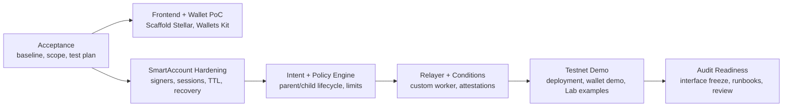

## 20. Build-Ready Task Breakdown

Immediate engineering tasks:

1. Add Scaffold Stellar app package.
2. Generate clients for SmartAccount, PolicyEngine, ConditionVerifier, IntentRegistry, and adapters.
3. Implement Wallets Kit connection with Freighter and xBull priority.
4. Implement `simulateAndSign` utility around Stellar RPC.
5. Build SmartAccount setup flow.
6. Build signer and threshold management UI.
7. Build asset, adapter, and destination configuration UI.
8. Build payment execution UI.
9. Build split execution UI.
10. Build automation creation UI.
11. Build relayer execution endpoint.
12. Complete IntentRegistry lifecycle.
13. Expand PolicyEngine.
14. Add testnet deployment scripts.
15. Add event indexing and audit log view.

## 21. Architecture Review Checklist

### Stellar Integration Checklist

- Contract account model is used for treasury authority.
- `__check_auth` validates signer authority and context.
- SAC is the only v1 asset interface.
- Stellar RPC simulation is required before submission.
- Freighter and xBull are supported through Wallets Kit.
- Scaffold Stellar is used for the frontend/client foundation.
- Stellar Lab can reproduce the PoC deployment and invocation flow.

### Security Checklist

- Relayer has no owner, management, governance, or recovery authority.
- Adapters cannot move funds independently.
- Asset allowlist defaults to deny.
- Destination allowlist defaults to deny.
- Adapter allowlist defaults to deny.
- Session keys are scoped, expiring, and capped.
- Automation capabilities pin policy version and execution window.
- Child execution IDs are unique and replay protected.
- Attestation IDs are unique and replay protected.
- Recovery freezes normal execution.
- Signer removal cannot break configured thresholds.
- Policy changes emit events and preserve automation semantics.
- Critical storage has TTL maintenance and monitoring.

### Grant Reviewer Evidence Checklist

- Public repository link.
- Technical architecture link.
- Testnet deployment instructions.
- Contract IDs for testnet demo.
- Wallet demo with Freighter and xBull.
- Lab invocation examples or saved requests.
- Passing test suite.
- Relayer demo logs showing simulation before submission.
- Event/audit trail for successful and rejected execution.
- Clear list of implemented, in-progress, and future hardening items in the milestone report.

## 22. Conclusion

STA is immediately buildable on Stellar because the core account architecture maps directly to Soroban contract accounts, SAC token flows, Wallets Kit signing, RPC simulation, and Lab-based testing.

The security model is intentionally conservative:

- SmartAccount is the root authority.
- Relayers are untrusted submitters.
- Assets and adapters are allowlisted.
- Automation is stored as bounded onchain capability.
- External conditions require verifier quorum.
- Recovery is separated from daily spend authority.

This makes STA suitable for treasury, payroll, vendor payment, marketplace payout, revenue distribution, DAO treasury, and tokenization platform workflows on Stellar.
